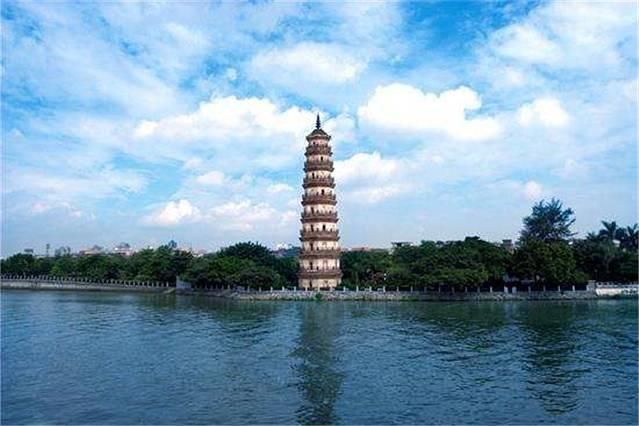

# 金鳌洲塔

## 景点图片

> 图片来源：[去哪儿旅行](https://touch.travel.qunar.com/poi/9599166)

## 基本信息

| 项目 | 内容 |
|------|------|
| 景点名称 | 金鳌洲塔 |
| 所在城市 | 东莞市 |
| 所在区县 | 万江街道 |
| 景点级别 | - |
| 景点类型 | 古塔 |
| 开放时间 | 全天开放 |
| 门票价格 | 详情请咨询景区 |

## 景点介绍

金鳌洲塔位于东莞市万江街道，是东莞市文物保护单位，也是东莞重要的历史地标建筑。金鳌洲塔始建于明代，为八角九层楼阁式砖塔，高约40米，造型古朴典雅。塔身以青砖砌筑，每层设有门窗，塔内有楼梯可登至顶层。金鳌洲塔矗立于东江之畔，是古代东莞水运交通的重要标志，也是文人墨客登高望远、吟诗作赋的场所。塔周环境优美，是了解东莞历史文化的绝佳去处。

## 景点特点

- 东莞市文物保护单位
- 明代八角九层楼阁式砖塔
- 高约40米，造型古朴典雅
- 东江之畔的重要历史地标
- 可登塔远眺东江美景

## 位置

- **地址**：广东省东莞市万江街道金泰村金鳌洲主题公园内
- **经纬度**：23.0383°N, 113.7359°E

## 交通

- **公交**：东莞市区可乘坐公交前往万江街道方向
- **自驾**：导航至金鳌洲塔即可

## 数据来源

- [东莞市文化广电旅游体育局](https://wglt.dg.gov.cn/)
- [金鳌洲塔（百度百科）](https://baike.baidu.com/item/%E9%87%91%E9%B3%8C%E6%B4%B2%E5%A1%94)

## 最后更新时间

2026-07-12
