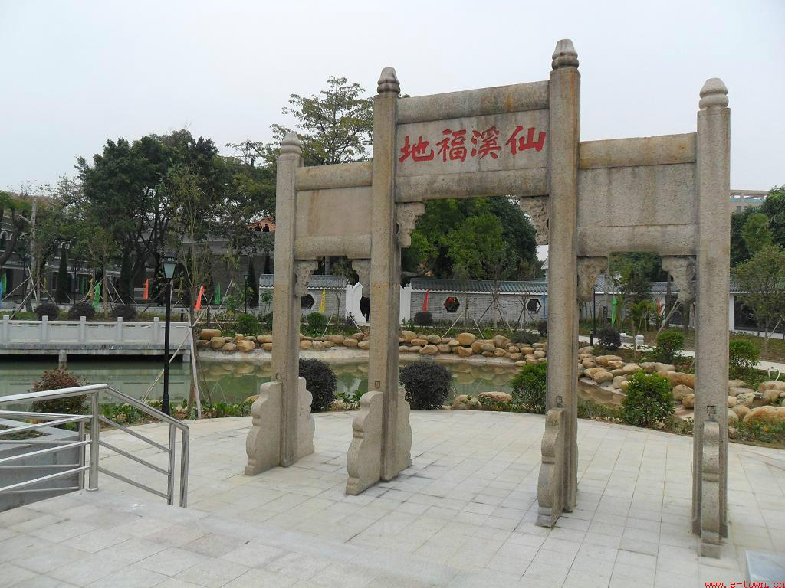

# 仙溪福地欧公文化旅游区

## 景点图片

> 图片来源：[360百科](https://baike.so.com/gallery/list?ghid=first&pic_idx=1&eid=24812875&sid=25741694)

## 基本信息

| 项目 | 内容 |
|------|------|
| 景点名称 | 仙溪福地欧公文化旅游区 |
| 所在城市 | 东莞市 |
| 所在区县 | 企石镇 |
| 景点级别 | 国家3A级景区 |
| 景点类型 | 文化旅游区 |
| 开放时间 | 全天开放 |
| 门票价格 | 详情请咨询景区 |

## 景点介绍

仙溪福地欧公文化旅游区位于东莞市企石镇，是以欧公文化为主题，融合自然风光和人文景观的特色旅游区。欧公即欧阳修，是北宋著名文学家、史学家，曾在岭南地区留下足迹。旅游区以欧阳修文化为核心，设有欧公祠、文化广场、碑林等景点，展示了欧阳修的生平事迹和文学成就。景区依山傍水，环境清幽，自然风光优美，是感受传统文化、欣赏自然美景的好去处。

## 景点特点

- 欧阳修文化主题旅游区
- 欧公祠、文化广场、碑林
- 展示欧阳修生平事迹和文学成就
- 依山傍水，环境清幽
- 自然风光与人文景观相融合

## 位置

- **地址**：广东省东莞市企石镇江边村仙溪福地欧公文化旅游区
- **经纬度**：22.9951°N, 113.8591°E

## 交通

- **公交**：东莞市区可乘坐公交前往企石镇方向
- **自驾**：导航至仙溪福地欧公文化旅游区即可

## 数据来源

- [东莞市文化广电旅游体育局](https://wglt.dg.gov.cn/)
- [仙溪福地欧公文化旅游区（百度百科）](https://baike.baidu.com/item/%E4%BB%99%E6%BA%AA%E7%A6%8F%E5%9C%B0%E6%AC%A7%E5%85%AC%E6%96%87%E5%8C%96%E6%97%85%E6%B8%B8%E5%8C%BA)

## 最后更新时间

2026-07-12
