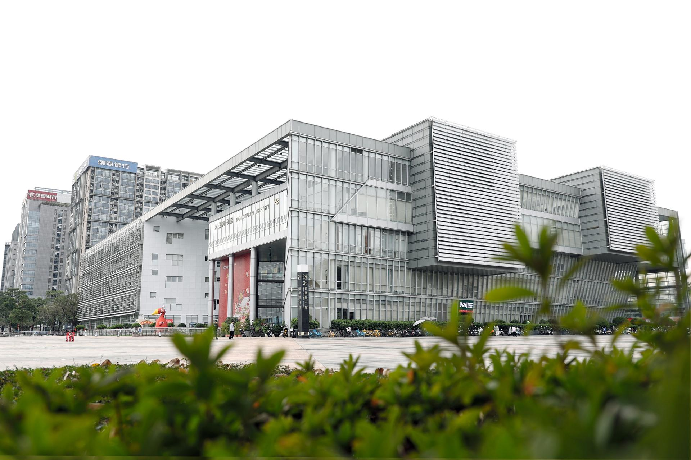

# 东莞图书馆

## 景点图片

> 图片来源：[东莞图书馆官方网站](https://www.dglib.cn/dglib/bgjs/201511/46856908a338425fa2f07bb55871511e.shtml)

## 基本信息

| 项目 | 内容 |
|------|------|
| 景点名称 | 东莞图书馆 |
| 所在城市 | 东莞市 |
| 所在区县 | 南城街道 |
| 景点级别 | - |
| 景点类型 | 图书馆 |
| 开放时间 | 全天开放 |
| 门票价格 | 详情请咨询景区 |

## 景点介绍

东莞图书馆位于东莞市南城街道，是东莞重要的文化地标和知识信息中心。图书馆建筑面积约4.5万平方米，设计现代，空间开阔，藏书丰富，拥有各类图书、报刊、电子资源等。图书馆设有多个阅览区、自习区、儿童阅读区、多媒体体验区等，设施先进，服务周到。图书馆还经常举办文化讲座、展览、读书活动等，是市民学习知识、文化交流的重要场所，也是东莞城市文化品位的重要体现。

## 景点特点

- 东莞重要文化地标
- 建筑面积约4.5万平方米
- 藏书丰富，设施先进
- 经常举办文化讲座和展览
- 市民学习和文化交流的重要场所

## 位置

- **地址**：广东省东莞市南城街道鸿福路南侧中心广场内
- **经纬度**：23.0136°N, 113.7519°E

## 交通

- **公交**：东莞市区可乘坐公交前往南城街道方向
- **自驾**：导航至东莞图书馆即可

## 数据来源

- [东莞市文化广电旅游体育局](https://wglt.dg.gov.cn/)
- [东莞图书馆官方网站](https://www.dglib.cn/)

## 最后更新时间

2026-07-12
