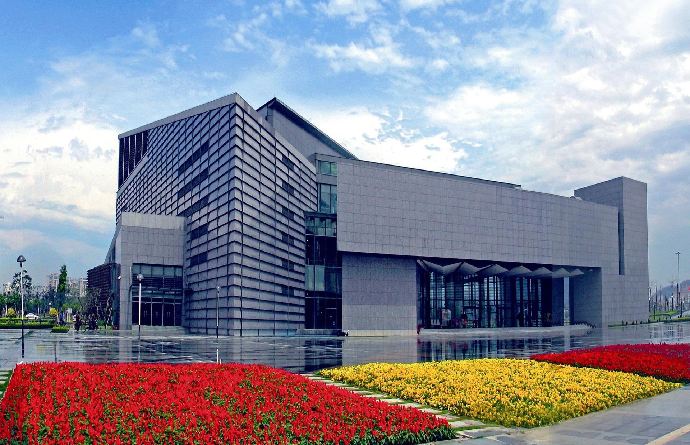

# 东莞展览馆

## 景点图片

> 图片来源：[360百科](https://baike.so.com/gallery/list?ghid=first&pic_idx=1&eid=6818327&sid=7035371)

## 基本信息

| 项目 | 内容 |
|------|------|
| 景点名称 | 东莞展览馆 |
| 所在城市 | 东莞市 |
| 所在区县 | 南城街道 |
| 景点级别 | 国家3A级景区 |
| 景点类型 | 展览馆 |
| 开放时间 | 全天开放 |
| 门票价格 | 详情请咨询景区 |

## 景点介绍

东莞展览馆位于东莞市南城街道，是展示东莞城市形象、历史文化和经济社会发展成就的重要窗口。展览馆建筑面积约4万平方米，设有多个展厅，通过图片、实物、模型、多媒体等形式，全面展示东莞从古至今的发展历程，包括岭南文化、近代开埠、改革开放、制造业名城等主题。展览馆设计现代，展陈内容丰富，是了解东莞城市发展脉络的最佳场所。

## 景点特点

- 展示东莞城市形象的重要窗口
- 全面展示东莞发展历程
- 岭南文化、制造业名城等主题
- 现代化的展陈手段
- 了解东莞城市文化的最佳场所

## 位置

- **地址**：广东省东莞市南城街道鸿福路97号
- **经纬度**：23.0164°N, 113.7485°E

## 交通

- **公交**：东莞市区可乘坐公交前往南城街道方向
- **自驾**：导航至东莞展览馆即可

## 数据来源

- [东莞市文化广电旅游体育局](https://wglt.dg.gov.cn/)
- [东莞展览馆（百度百科）](https://baike.baidu.com/item/%E4%B8%9C%E8%8E%9E%E5%B1%95%E8%A7%88%E9%A6%86)

## 最后更新时间

2026-07-12
