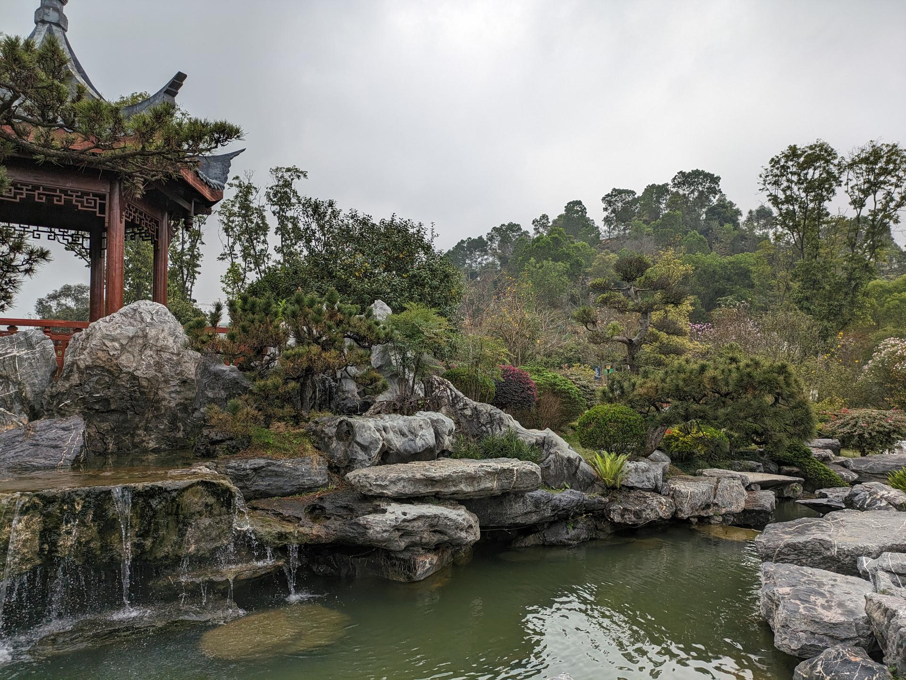

# 东莞植物园

## 景点图片

> 图片来源：[Wikimedia Commons](https://commons.wikimedia.org/wiki/File:%E4%B8%9C%E8%8E%9E%E6%A4%8D%E7%89%A9%E5%9B%AD3.jpg) · 许可证：CC BY-SA 4.0

## 基本信息

| 项目 | 内容 |
|------|------|
| 景点名称 | 东莞植物园 |
| 所在城市 | 东莞市 |
| 所在区县 | 南城街道 |
| 景点级别 | 国家AAA级景区 |
| 景点类型 | 植物园 |
| 开放时间 | 06:00-21:00（全天开放） |
| 门票价格 | 免费 |

## 景点介绍

东莞植物园位于东莞市南城街道，占地面积约396公顷，是东莞市最大的植物园，也是集科研、科普、休闲于一体的综合性植物园。园内植物资源丰富，收集保存植物约3000多种，其中不乏珍稀濒危物种。

东莞植物园由多个特色园区组成，包括名树名花园、兰花园、蕨园、药用植物园、盆景园等。园区生态环境优美，空气清新，是市民休闲健身、科普教育的重要场所。每年举办的兰花展、茶花展等活动吸引了大量游客。

## 景点特点

- **植物丰富**：收集保存植物约3000多种
- **特色园区**：多个主题园区各具特色
- **生态环境**：空气清新，适合休闲健身
- **科普教育**：设有科普展馆，开展自然教育活动
- **免费开放**：全天免费向公众开放

## 位置

- **地址**：东莞市南城街道绿色路99号
- **经纬度**：22.9654°N, 113.7509°E

## 交通

- **地铁**：暂无直达地铁
- **公交**：多路公交可达，如10路、39路等
- **自驾**：可停放在植物园停车场

## 数据来源

- [东莞植物园官方网站](http://www.dgplantgarden.com/)

## 最后更新时间

2026-06-20
