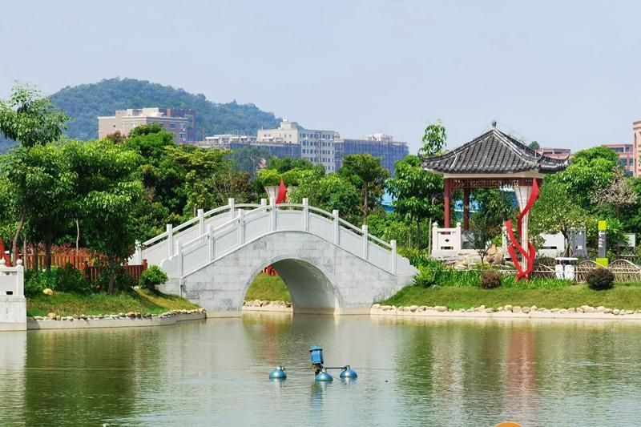

# 寒溪水文化旅游景区

## 景点图片

> 图片来源：[东莞阳光网](https://news.sun0769.com/zhuanti/2020/zczb/cs/)

## 基本信息

| 项目 | 内容 |
| --- | --- |
| 景点名称 | 寒溪水文化旅游景区 |
| 所在城市 | 东莞市 |
| 所在区县 | 茶山镇 |
| 景点级别 | 国家3A级旅游景区 |
| 景点类型 | 乡村旅游、红色文化 |
| 开放时间 | 以景区最新公告为准 |
| 门票价格 | 公共区域免费开放 |

## 景点介绍

寒溪水文化旅游景区位于东莞市茶山镇寒溪水村，以乡村人文景观、红色文化和生态休闲空间为核心。景区保留村落历史肌理，并结合罗氏革命史迹、乡村景观提升和公共文化空间形成适合休闲游览、研学教育的乡村旅游目的地。

## 景点特点

- 岭南乡村风貌与田园景观
- 红色文化和村史研学资源
- 公共艺术与乡村休闲空间

## 位置

- **地址**：广东省东莞市茶山镇寒溪水村
- **经纬度**：23.044°N, 113.8769°E

## 交通

- **公交**：乘坐前往茶山镇寒溪水村的公交线路，下车后按景区导向步行游览
- **自驾**：导航搜索“寒溪水文化旅游景区”

## 数据来源

- [东莞市文化广电旅游体育局](https://wglt.dg.gov.cn/)
- [东莞市茶山镇人民政府](https://www.dg.gov.cn/chashan/)

## 最后更新时间

2026-07-14
