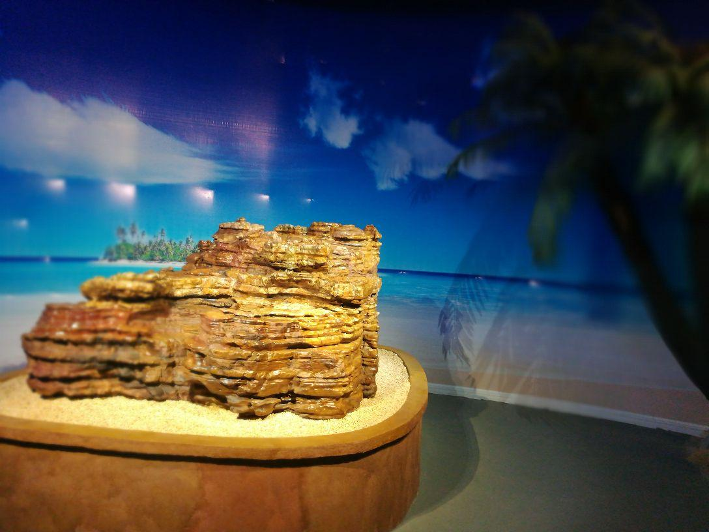

# 森晖自然博物馆

## 景点图片

> 图片来源：[去哪儿旅行](https://touch.travel.qunar.com/comment/10156780783)

## 基本信息

| 项目 | 内容 |
| --- | --- |
| 景点名称 | 森晖自然博物馆 |
| 所在城市 | 东莞市 |
| 所在区县 | 莞城街道 |
| 景点级别 | 国家3A级旅游景区 |
| 景点类型 | 自然类博物馆 |
| 开放时间 | 以场馆最新公告为准 |
| 门票价格 | 以场馆最新公告为准 |

## 景点介绍

森晖自然博物馆位于东莞市莞城街道可园路，是以自然标本收藏、展示和科普教育为主要内容的专题博物馆。馆内展陈涵盖矿物、古生物和动植物等自然资源，适合亲子参观及自然科学研学。

## 景点特点

- 自然标本专题展示
- 自然科学普及与研学活动
- 临近东莞可园，便于联游

## 位置

- **地址**：广东省东莞市莞城街道可园路
- **经纬度**：23.021°N, 113.7519°E

## 交通

- **公交**：乘坐途经可园片区的公交线路，在可园附近站点下车后步行前往
- **自驾**：导航搜索“森晖自然博物馆”，按现场指引停车

## 数据来源

- [东莞市文化广电旅游体育局](https://wglt.dg.gov.cn/)
- [森晖自然博物馆（百度百科）](https://baike.baidu.com/item/%E6%A3%AE%E6%99%96%E8%87%AA%E7%84%B6%E5%8D%9A%E7%89%A9%E9%A6%86)

## 最后更新时间

2026-07-14
