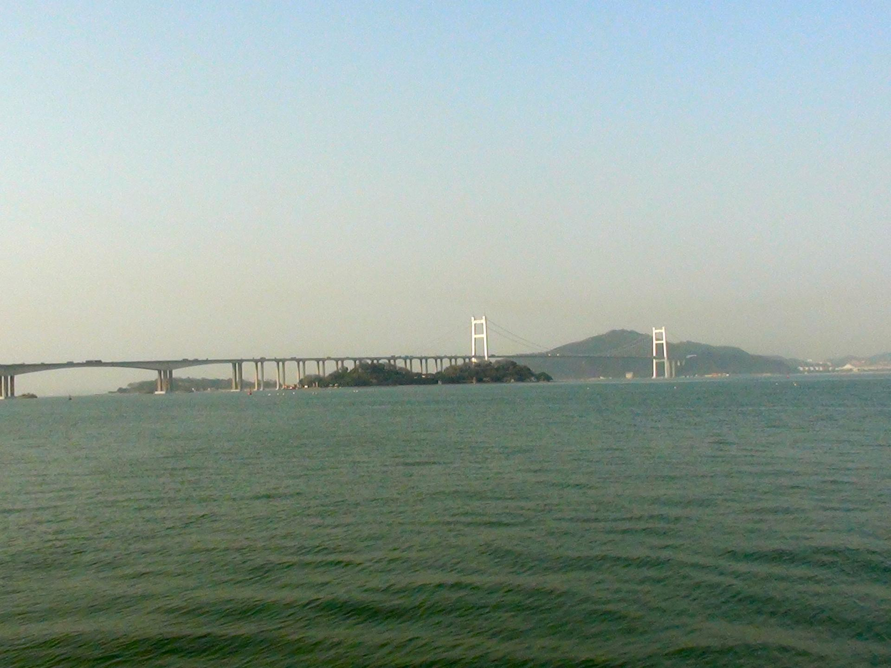

# 虎门大桥

## 景点图片

> 图片来源：[Wikimedia Commons](https://commons.wikimedia.org/wiki/File:%E8%99%8E%E9%97%A8%E5%A4%A7%E6%A1%A5.JPG) · 许可证：CC BY-SA 4.0

## 基本信息

| 项目 | 内容 |
|------|------|
| 景点名称 | 虎门大桥 |
| 所在城市 | 东莞市 |
| 所在区县 | 虎门镇 |
| 景点级别 | 地标建筑 |
| 景点类型 | 地标 |
| 开放时间 | 全天开放 |
| 门票价格 | 免费 |

## 景点介绍

虎门大桥位于东莞市虎门镇与广州市南沙区之间，横跨珠江口，全长15.76公里，主桥跨径888米，是连接珠江东西两岸的重要交通枢纽。虎门大桥于1997年建成通车，是当时中国跨度最大的悬索桥。

虎门大桥不仅是重要的交通设施，也是珠江口的标志性建筑。站在桥上可以远眺珠江口的壮阔景色，俯瞰珠江两岸的城市风光。大桥与虎门炮台遗址、鸦片战争博物馆等历史景点相邻，形成了独特的历史与现代交融的景观。

## 景点特点

- **交通要道**：连接珠江东西两岸的重要通道
- **建筑壮观**：中国跨度最大的悬索桥之一
- **珠江口景观**：可远眺珠江口壮阔景色
- **历史交融**：与虎门炮台等历史遗迹相邻
- **夜景美丽**：夜晚大桥灯光璀璨，景色迷人

## 位置

- **地址**：东莞市虎门镇（珠江口）
- **经纬度**：22.8100°N, 113.5200°E

## 交通

- **地铁**：暂无直达地铁
- **公交**：虎门镇内多路公交可达
- **自驾**：可通过虎门大桥连接线前往

## 数据来源

- [虎门大桥相关信息](https://baike.baidu.com/item/虎门大桥)

## 最后更新时间

2026-06-20
