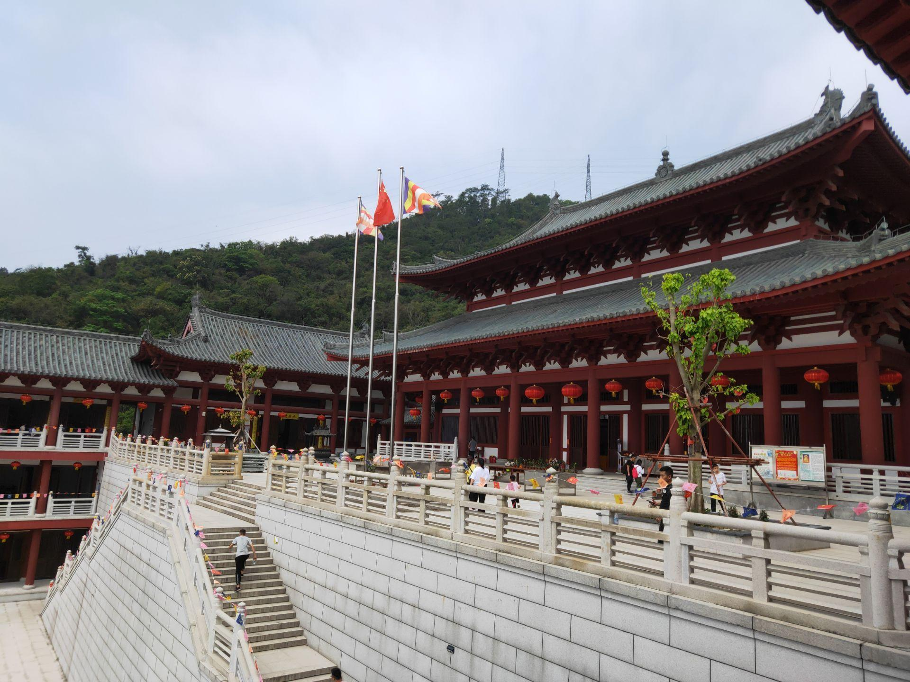

# 长安莲花山

## 景点图片

> 图片来源：[去哪儿旅行](https://touch.travel.qunar.com/comment/10158598748)

## 基本信息

| 项目 | 内容 |
|------|------|
| 景点名称 | 长安莲花山 |
| 所在城市 | 东莞市 |
| 所在区县 | 长安镇 |
| 景点级别 | - |
| 景点类型 | 郊野公园 |
| 开放时间 | 全天开放 |
| 门票价格 | 详情请咨询景区 |

## 景点介绍

长安莲花山位于东莞市长安镇，是长安镇重要的自然生态景区和郊野公园。莲花山因山形似莲花而得名，山势不高但景色秀丽。山上植被茂密，四季常青，空气清新。公园内设有登山步道、休息亭、观景平台等设施，登山难度适中，适合各年龄段游客。山顶视野开阔，可俯瞰长安镇全貌和周边田园风光。莲花山是长安镇及周边居民休闲健身、亲近自然的重要场所。

## 景点特点

- 长安镇重要自然生态景区
- 山形似莲花，景色秀丽
- 登山步道适合各年龄段
- 山顶可俯瞰长安镇全貌
- 市民休闲健身好去处

## 位置

- **地址**：广东省东莞市长安镇莲花山郊野公园
- **经纬度**：22.8404°N, 113.8083°E

## 交通

- **公交**：东莞市区可乘坐公交前往长安镇方向
- **自驾**：导航至长安莲花山即可

## 数据来源

- [东莞市文化广电旅游体育局](https://wglt.dg.gov.cn/)
- [长安莲花山（百度百科）](https://baike.baidu.com/item/%E9%95%BF%E5%AE%89%E8%8E%B2%E8%8A%B1%E5%B1%B1)

## 最后更新时间

2026-07-12
