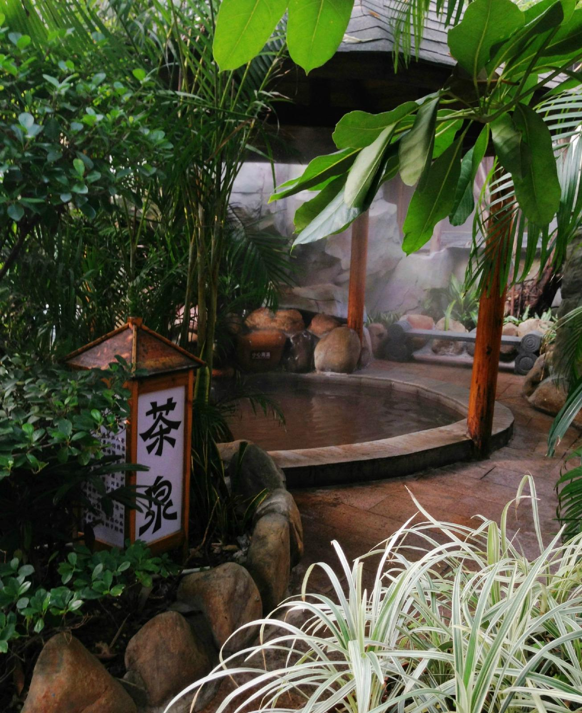

# 中山温泉

## 景点图片

> 图片来源：[去哪儿旅行](https://img1.qunarzz.com/travel/d0/1511/3c/8032516ad36eff7.jpg)

## 景点介绍

中山温泉位于中山市三乡镇雍陌村，是广东省最早的温泉度假区之一，也是中国第一家中外合作酒店所在地。中山温泉始建于1979年，由霍英东先生投资兴建，是中国改革开放的重要历史见证。

中山温泉水质优良，属于氯化钠型温泉，泉水温度约60-70°C，富含多种对人体有益的矿物质和微量元素。温泉区设有多个不同功能的温泉池，包括中药池、花瓣池、鱼疗池等特色泡池，还有高尔夫球场、网球场等休闲设施。中山温泉度假区配套设施齐全，拥有多家酒店、餐厅、会议中心等，是商务会议和休闲度假的理想场所。

中山温泉历史悠久，见证了中国改革开放的历程，是中山市重要的旅游和休闲度假目的地。

## 景点特点

- **中国第一家中外合作酒店**：1979年兴建，改革开放的重要见证
- **优质温泉**：水温约60-70°C，富含多种矿物质
- **历史悠久**：广东省最早的温泉度假区之一
- **配套设施齐全**：高尔夫球场、网球场等
- **休闲度假**：中山市重要的度假目的地

## 位置

- **地址**：中山市三乡镇中山温泉
- **经纬度**：22.3523°N, 113.4572°E

## 交通

- **自驾**：中山市区出发约30分钟车程
- **公交**：中山市内有公交可达

## 数据来源

- [百度百科-中山温泉](https://baike.baidu.com/item/中山温泉)

## 最后更新时间

2026-07-19

