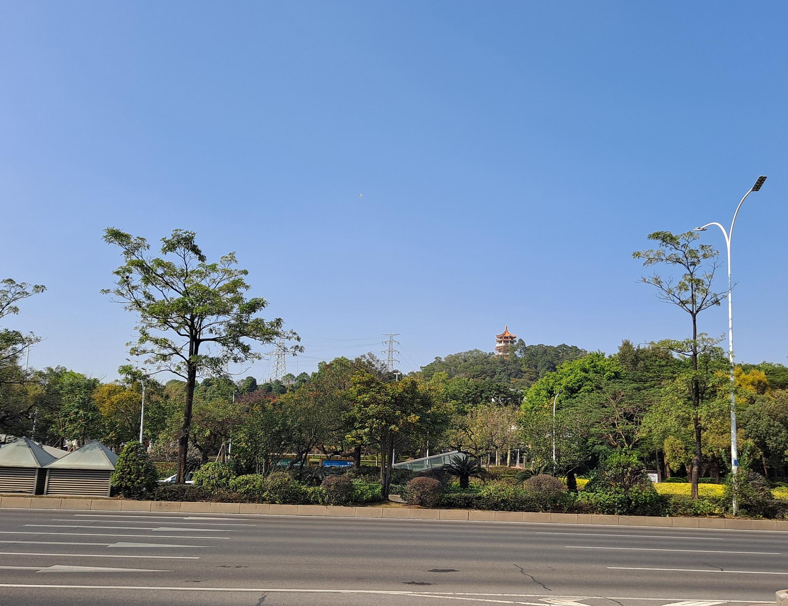

# 紫马岭公园

## 景点图片

> 图片来源：[Wikimedia Commons](https://commons.wikimedia.org/wiki/File:%E7%B4%AB%E9%A9%AC%E5%B2%AD%E5%85%AC%E5%9B%AD.jpg) · 许可证：CC BY-SA 4.0

## 基本信息

| 项目 | 内容 |
|------|------|
| 景点名称 | 紫马岭公园 |
| 所在城市 | 中山市 |
| 所在区县 | 东区 |
| 景点级别 | 无 |
| 景点类型 | 城市公园 |
| 开放时间 | 全天开放 |
| 门票价格 | 免费 |

## 景点介绍

紫马岭公园位于中山市东区，占地面积约1400亩，是中山市最大的城市公园。公园内有紫马岭、玫瑰园、百花园等景点，是市民休闲健身的好去处。公园始建于1993年，经过多年建设，已成为中山市的标志性公园之一。这里绿树成荫，花草繁茂，是城市中难得的绿色空间，也是市民晨练、散步、家庭出游的热门场所。

## 景点特点

1. **规模宏大**：占地约1400亩，是中山最大的城市公园
2. **景点丰富**：有紫马岭、玫瑰园、百花园等多个景点
3. **免费开放**：市民和游客可免费参观游览
4. **功能齐全**：是市民休闲健身、家庭出游的好去处
5. **绿化优良**：绿树成荫，花草繁茂，生态环境良好

## 位置

- **地址**：中山市东区博爱六路紫马岭公园
- **经纬度**：22.5079°N, 113.4111°E

## 交通

- **地铁**：无
- **公交**：中山市区乘坐001路、006路、023路等公交车可达
- **自驾**：从中山市区出发，沿博爱六路行驶即可到达

## 数据来源

- [百度百科-中山市](https://baike.baidu.com/item/%E4%B8%AD%E5%B1%B1%E5%B8%82)

## 最后更新时间

2026-06-25
