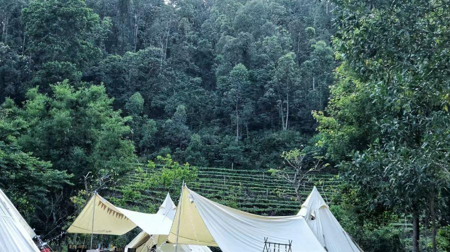

# 中山市大尖山露营公园景区

## 景点图片

> 图片来源：[携程攻略](https://dimg04.c-ctrip.com/images/0106z120009lbm6y83FC4_C_900_504.jpg)

## 基本信息

| 项目 | 内容 |
|------|------|
| 景点名称 | 中山市大尖山露营公园景区 |
| 所在城市 | 中山市 |
| 所在区县 | 五桂山区 |
| 景点级别 | 3A级景区 |
| 景点类型 | 露营公园 |
| 开放时间 | 09:00-22:00（露营需预约） |
| 门票价格 | 约20元（露营另计） |

## 景点介绍

中山市大尖山露营公园景区位于广东省中山市五桂山区大尖山脚下，是一个以户外露营、休闲运动、自然教育为主题的生态旅游景区。公园占地面积约300亩，依托大尖山优越的自然生态环境，打造了集露营、烧烤、徒步、亲子活动于一体的综合性户外休闲场所。

大尖山是中山市五桂山区的标志性山峰之一，海拔约300米，山势挺拔，景色秀丽。露营公园位于山脚平坦地带，设有露营区、烧烤区、篝火区、儿童游乐区等多个功能区域。公园内配备有完善的露营设施，包括帐篷租赁、淋浴间、卫生间等，为游客提供舒适的露营体验。

大尖山露营公园还设有登山步道，游客可以沿步道攀登大尖山，登顶后俯瞰中山市区和五桂山区的壮丽景色。公园定期举办户外拓展、自然教育、星空观测等活动，深受年轻人和亲子家庭的喜爱。

## 景点特点

- **户外露营**：设有专业露营区，提供帐篷租赁等设施，适合露营爱好者
- **登山健身**：可攀登大尖山，登顶俯瞰中山全景
- **亲子活动**：设有儿童游乐区，适合家庭亲子出游
- **烧烤休闲**：提供烧烤区，适合朋友聚会和团队活动
- **自然教育**：定期举办户外拓展和自然教育活动
- **星空观测**：远离城市光污染，适合夜间观星

## 位置

- **地址**：广东省中山市五桂山区大尖山露营公园
- **经纬度**：22.4098°N, 113.4256°E

## 交通

- **公交**：中山市区乘坐013路、090路公交车至五桂山办事处站下车，换乘村镇公交前往
- **自驾**：从中山市区沿城桂公路向五桂山方向行驶，按指示牌指引即可到达
- **停车场**：公园设有大型停车场

## 数据来源

- [中山市文化广电旅游局](https://www.zs.gov.cn/)
- [百度百科-中山市](https://baike.baidu.com/item/%E4%B8%AD%E5%B1%B1%E5%B8%82)

## 最后更新时间

2026-07-19

