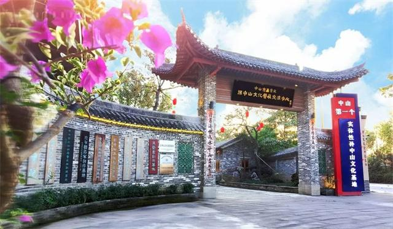

# 中山市荔景苑景区

## 景点图片

> 图片来源：[zsrbapp.zsnews.cn](https://zsrbapp.zsnews.cn/upload/20221130/1a977be6eb51ccaeabea443a7de7f5ba.jpg)

## 基本信息

| 项目 | 内容 |
|------|------|
| 景点名称 | 中山市荔景苑景区 |
| 所在城市 | 中山市 |
| 所在区县 | 南区街道 |
| 景点级别 | 3A级景区 |
| 景点类型 | 岭南园林 |
| 开放时间 | 08:00-18:00 |
| 门票价格 | 免费 |

## 景点介绍

中山市荔景苑景区位于广东省中山市南区街道，是一座以岭南园林艺术为主题的综合性旅游景区。荔景苑占地面积约60亩，以荔枝文化为特色，融合岭南传统园林建筑风格，园内种植大量荔枝树，营造出浓郁的岭南田园风光。

荔景苑景区以"荔"为主题，园内建筑古朴典雅，亭台楼阁错落有致，小桥流水相映成趣。景区内设有荔枝文化展览馆，展示荔枝的种植历史、品种分类和文化内涵，让游客在欣赏园林美景的同时，了解荔枝文化的深厚底蕴。

荔景苑不仅是园林景观的展示场所，也是休闲娱乐的好去处。园内设有茶室、餐厅等配套设施，游客可以在此品茶赏景、品尝荔枝美食，感受岭南文化的独特魅力。

## 景点特点

- **荔枝文化主题**：以荔枝文化为核心，园内种植大量荔枝树，设有荔枝文化展览馆
- **岭南园林风格**：建筑古朴典雅，亭台楼阁错落有致，展现岭南传统园林艺术
- **免费开放**：对市民和游客免费开放，是休闲散步的好去处
- **环境优美**：园内绿树成荫，小桥流水，环境清幽宜人
- **文化体验丰富**：定期举办荔枝文化节、书画展览等文化活动
- **配套设施完善**：设有茶室、餐厅等配套设施，适合家庭出游

## 位置

- **地址**：广东省中山市南区街道荔景苑路
- **经纬度**：22.4785°N, 113.3452°E

## 交通

- **公交**：中山市区乘坐005路、014路、021路公交车至南区市场站下车，步行约500米
- **自驾**：从中山市区沿南外环路行驶至南区街道，按指示牌指引即可到达
- **停车场**：景区设有小型停车场

## 数据来源

- [中山市文化广电旅游局](https://www.zs.gov.cn/)
- [百度百科-中山市](https://baike.baidu.com/item/%E4%B8%AD%E5%B1%B1%E5%B8%82)

## 最后更新时间

2026-07-19

