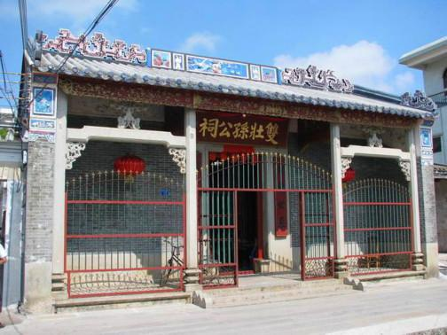

# 中山市左步村乡村旅游景区

## 景点图片

> 图片来源：[百度百科](https://bkimg.cdn.bcebos.com/pic/b21c8701a18b87d6277f2a594f503f381f30e9245766?x-bce-process=image/format,f_auto/resize,m_lfit,limit_1,w_504)

## 基本信息

| 项目 | 内容 |
|------|------|
| 景点名称 | 中山市左步村乡村旅游景区 |
| 所在城市 | 中山市 |
| 所在区县 | 南朗镇 |
| 景点级别 | 3A级景区 |
| 景点类型 | 乡村旅游 |
| 开放时间 | 全天开放 |
| 门票价格 | 免费 |

## 景点介绍

中山市左步村乡村旅游景区位于广东省中山市南朗镇左步村，是一个以历史文化名村、田园风光和乡村体验为主题的乡村旅游景区。左步村始建于南宋年间，距今已有700多年历史，是中山市著名的历史文化名村，也是孙中山先生的祖居地之一。

左步村人杰地灵，名人辈出，村内保留了大量历史建筑和文化遗产。著名的左步碉楼、左步孙氏宗祠、欧氏宗祠等历史建筑保存完好，展现了岭南传统建筑的独特魅力。村内还有孙中山先生先祖故居遗址，具有重要的历史纪念意义。

近年来，左步村依托丰富的历史文化资源和优美的田园风光，大力发展乡村旅游，打造了古村观光、文化寻访、田园休闲、农家体验等多种旅游项目。左步村还以稻田风光闻名，每年稻谷成熟时节，金黄的稻田与古村建筑相映成趣，成为摄影爱好者的热门打卡地。

## 景点特点

- **历史文化名村**：700多年历史的古村落，孙中山祖居地之一
- **历史建筑丰富**：保留碉楼、宗祠等大量历史建筑
- **稻田风光**：田园风光优美，稻田景观是摄影打卡热点
- **文化底蕴深厚**：名人辈出，历史文化资源丰富
- **免费开放**：全天免费开放，适合文化寻访和休闲观光
- **乡村体验**：提供农家体验、田园休闲等乡村旅游项目

## 位置

- **地址**：广东省中山市南朗镇左步村
- **经纬度**：22.4568°N, 113.5128°E

## 交通

- **公交**：中山市区乘坐12路、212路公交车至南朗镇站下车，换乘村镇公交前往左步村
- **自驾**：从中山市区沿S111省道行驶至南朗镇，按指示牌指引即可到达
- **停车场**：村口设有停车场

## 数据来源

- [中山市文化广电旅游局](https://www.zs.gov.cn/)
- [百度百科-中山市](https://baike.baidu.com/item/%E4%B8%AD%E5%B1%B1%E5%B8%82)

## 最后更新时间

2026-07-19

