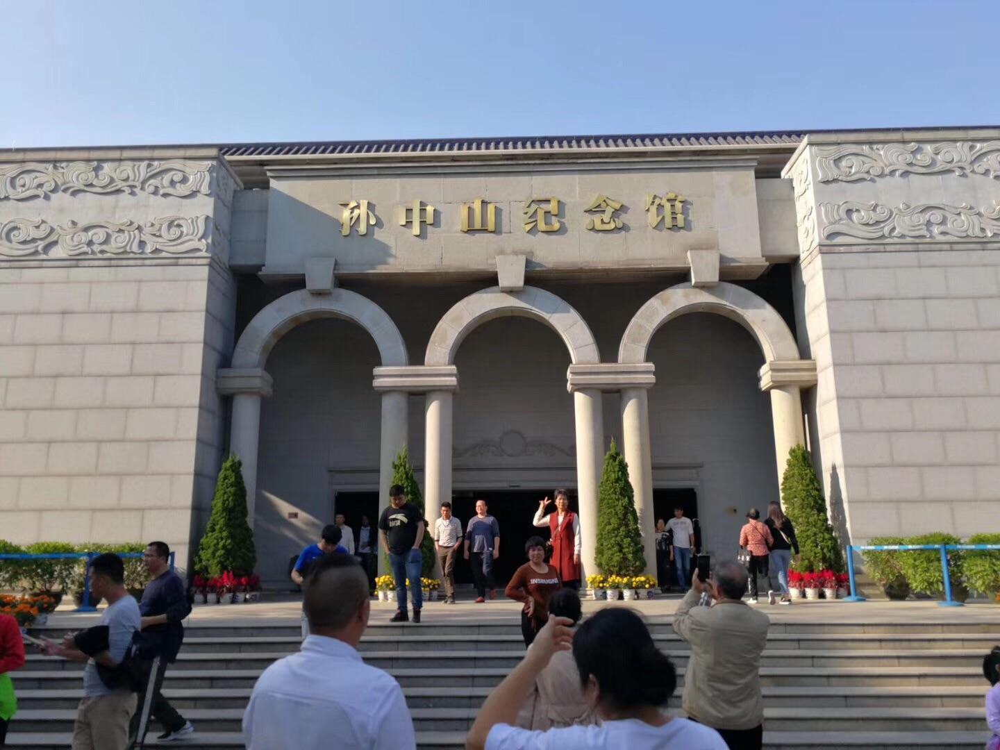

# 孙中山故居

## 景点图片

> 图片来源：[携程攻略](https://youimg1.c-ctrip.com/target/100f1b0000019yo9v24C3.jpg)

## 景点介绍

孙中山故居位于广东省中山市南朗镇翠亨村，是伟大的民主革命先驱孙中山先生的诞生地。故居始建于清光绪年间，是一座中西合璧的砖木结构建筑，体现了岭南传统民居与西方建筑风格的融合。

故居建筑坐东朝西，占地约500平方米，建筑面积约340平方米。建筑外观为三层楼阁式，融合了中国传统建筑元素与西方建筑特色，包括拱形门窗、铁艺栏杆等装饰。故居内保留了孙中山先生早年生活的历史遗迹，展示了孙中山先生的革命生涯和贡献。

孙中山故居现为全国重点文物保护单位，也是国家AAAAA级旅游景区。故居周边环境优美，绿树成荫，是了解孙中山先生生平事迹和中国近代革命历史的重要场所。

## 景点特点

- 中西合璧的建筑风格，展现岭南传统与西方建筑特色的融合
- 孙中山先生的诞生地，具有重要的历史纪念意义
- 保留完整的历史遗迹，展示孙中山先生的生平事迹
- 全国重点文物保护单位，国家AAAAA级旅游景区
- 周边环境优美，绿树成荫，适合文化参观和休闲游览
- 定期举办纪念活动和展览，提供丰富的文化体验

## 位置

- **地址**：广东省中山市南朗镇翠亨村
- **经纬度**：22.4408°N, 113.5279°E

## 交通

- 公交：中山市区乘坐12路、212路公交车至翠亨站下车
- 自驾：从中山市区沿S111省道行驶约20公里即可到达
- 停车场：景区设有大型停车场，可停放各类车辆

## 数据来源

- [中山市文化广电旅游局](https://www.zhongshan.gov.cn/)
- [孙中山故居纪念馆官方网站](https://www.sunyat-sen.org/)
- [百度百科-孙中山故居](https://baike.baidu.com/item/%E5%AD%99%E4%B8%AD%E5%B1%B1%E6%95%85%E5%B1%85)

## 最后更新时间

2026-07-19

