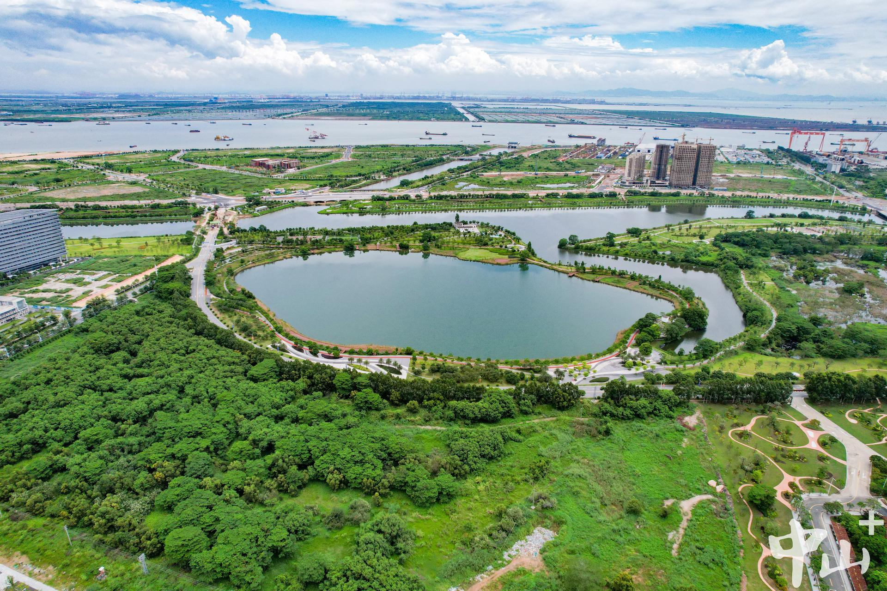

# 翠亨新区

## 景点图片

> 图片来源：[zsrbapp.zsnews.cn](https://zsrbapp.zsnews.cn/upload/20230801/4114ab78febfbe9943650eac9f5445f7.jpeg)

## 景点特点

- **孙中山故乡**：孙中山先生的出生地
- **孙中山故居**：全国重点文物保护单位
- **中山影视城**：影视拍摄基地
- **综合性旅游区**：集历史文化、自然风光、休闲度假于一体
- **免费开放**：可自由参观

## 位置

- **地址**：中山市南朗镇翠亨新区
- **经纬度**：22.4837°N, 113.5374°E

## 交通

- **公交**：中山市内12路公交至翠亨站
- **自驾**：可停放至翠亨新区停车场

## 数据来源

- [百度百科-翠亨村](https://baike.baidu.com/item/%E7%BF%A0%E4%BA%A8%E6%9D%91/54923)

## 最后更新时间

2026-07-19

