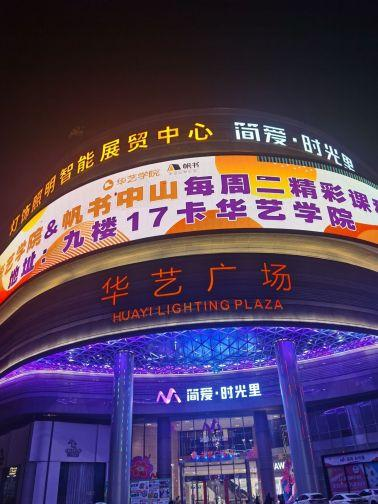

# 中山市华艺广场

## 景点图片

> 图片来源：[百度百科](https://bkimg.cdn.bcebos.com/smart/b219ebc4b74543a982262d6b1d4b9d82b9014a90be5a-bkimg-process,v_1,rw_189,rh_252,maxl_504?x-bce-process=image/format,f_auto)

## 景点特点

- **灯饰文化主题**：以灯饰文化为核心，展现灯光艺术魅力
- **国家4A级景区**：中山市重要的文化旅游景区
- **灯饰文化博物馆**：展示灯饰发展历史与精美灯饰艺术品
- **光影艺术**：建筑外立面灯光秀绚丽多彩
- **规模宏大**：总建筑面积约42万平方米
- **购物休闲一体**：集灯饰采购、餐饮、娱乐于一体

## 位置

- **地址**：广东省中山市古镇镇中兴大道南1号
- **经纬度**：22.6026°N, 113.1893°E

## 交通

- **公交**：中山市内乘坐公交至古镇镇华艺广场站下车
- **自驾**：广珠西线高速古镇出口下，沿中兴大道直达

## 数据来源

- [百度百科-华艺广场](https://baike.baidu.com/item/%E5%8D%8E%E8%89%BA%E5%B9%BF%E5%9C%BA)

## 最后更新时间

2026-07-19

