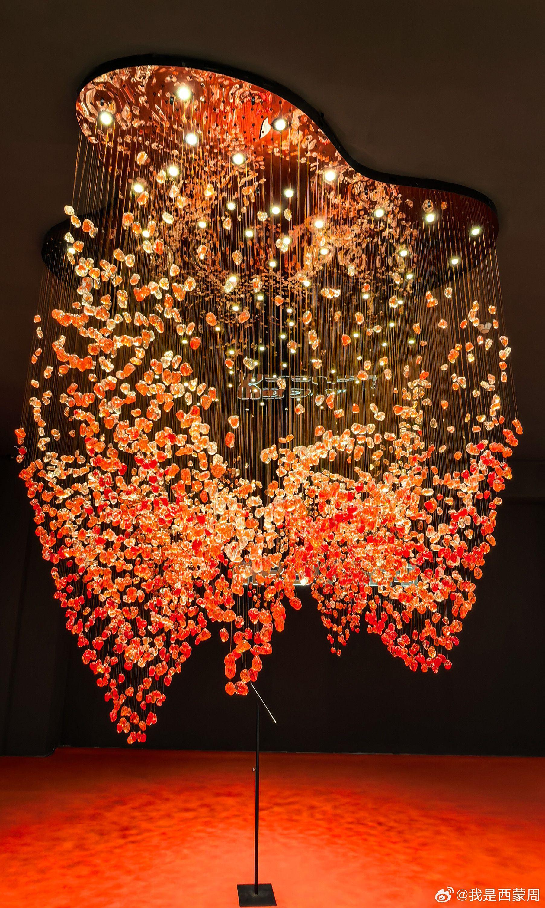

# 中山市星光联盟·全球品牌灯饰中心景区

## 景点图片

> 图片来源：[新浪网](https://n.sinaimg.cn/sinakd/sni/5/w1805h3000/20251123/5555-53382aeb63e90126c635cf720213a283.jpg)

## 基本信息

| 项目 | 内容 |
|------|------|
| 景点名称 | 中山市星光联盟·全球品牌灯饰中心景区 |
| 所在城市 | 中山市 |
| 所在区县 | 古镇镇 |
| 景点级别 | 3A级景区 |
| 景点类型 | 灯饰文化体验景区 |
| 开放时间 | 09:00-21:00 |
| 门票价格 | 免费 |

## 景点介绍

星光联盟·全球品牌灯饰中心位于广东省中山市古镇镇，是国家AAA级旅游景区。星光联盟总建筑面积约36万平方米，是全球灯饰品牌集聚中心，集灯饰展示、设计交流、采购交易、文化旅游于一体。作为古镇镇灯饰产业的重要展示窗口，星光联盟汇聚了众多国内外知名灯饰品牌，设有多个品牌灯饰体验区，展示各类灯饰产品的最新设计潮流。

星光联盟的建筑设计独具特色，外立面采用现代玻璃幕墙设计，内部空间宽敞明亮，设有灯光艺术展示区、品牌体验馆和休闲服务区。景区内定期举办灯饰新品发布会、设计论坛和灯光艺术展览，是灯饰产业从业者和游客了解灯饰文化、欣赏灯饰艺术的重要场所。

## 景点特点

- **全球灯饰品牌集聚**：汇聚众多国内外知名灯饰品牌
- **国家3A级景区**：中山市重要的工业旅游景点
- **灯饰展示体验**：设有品牌灯饰体验区和灯光艺术展示区
- **建筑设计独特**：现代玻璃幕墙设计，内部空间宽敞明亮
- **产业文化融合**：灯饰展示、设计交流、采购交易于一体
- **定期展览活动**：举办新品发布会、设计论坛和灯光艺术展览

## 位置

- **地址**：广东省中山市古镇镇中兴大道
- **经纬度**：22.6072°N, 113.1895°E

## 交通

- **公交**：中山市内乘坐公交至古镇镇星光联盟站下车
- **自驾**：广珠西线高速古镇出口下，沿中兴大道直达

## 数据来源

- [百度百科-星光联盟](https://baike.baidu.com/item/%E6%98%9F%E5%85%89%E8%81%94%E7%9B%9F/23564811)
- [中山市文化广电旅游局](https://www.zs.gov.cn/wgxlj/)

## 最后更新时间

2026-07-19

