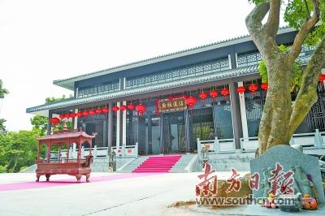

# 坦洲林里马耳古村落

## 景点图片

> 图片来源：[新浪网](https://n.sinaimg.cn/translate/w400h266/20180124/YOeb-fyqwiqi9666621.jpg)

## 景点特点

- 拥有300多年历史的岭南古村落，始建于明末清初
- 保存完好的中西合璧骑楼建筑群，融合岭南传统与欧洲建筑风格
- 建筑细节精美，拱形门窗、雕花柱头和山花装饰独具特色
- 村内有多处宗祠、庙宇和古井，见证村落历史变迁
- 反映了坦洲作为近代通商口岸的历史背景和中西文化交流
- 免费开放，适合历史文化爱好者和摄影爱好者探访

## 位置

- **地址**：广东省中山市坦洲镇林里社区马耳村
- **经纬度**：22.2701°N, 113.4798°E

## 交通

- **公交**：乘坐坦洲镇内公交线路至林里马耳站下车
- **自驾**：从中山市区沿G105国道向南行驶至坦洲镇，沿环村北路即可到达古村落

## 数据来源

- [百度百科-坦洲林里马耳古村落](https://baike.baidu.com/item/坦洲林里马耳古村落)

## 最后更新时间

2026-07-19

