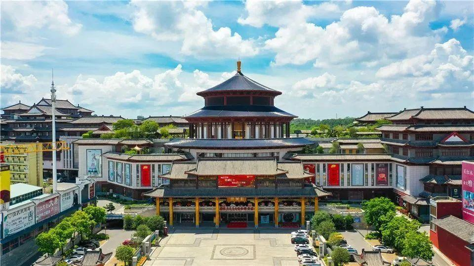

# 中国（大涌）红木文化博览城

## 景点图片

> 图片来源：[百度百科](https://bkimg.cdn.bcebos.com/pic/3ac79f3df8dcd100baa1cfd6dadd5010b912c9fc81b4?x-bce-process=image/format,f_auto/resize,m_lfit,limit_1,h_718)

## 景点特点

- **红木文化主题**：以红木文化为核心，展示中国传统家具艺术魅力
- **规模宏大**：占地300亩，建筑面积约80万平方米，气势恢宏
- **镇馆之宝**：珍藏崖柏、黄花梨、乌木等珍稀名贵艺术品
- **岭南建筑风格**：融合传统岭南建筑与现代设计元素
- **一站式体验**：集文化展示、购物、休闲、餐饮于一体
- **国家4A级景区**：中山市重要文化旅游目的地

## 位置

- **地址**：广东省中山市大涌镇岐涌路
- **经纬度**：22.2959°N, 113.4575°E

## 交通

- **公交**：中山市内乘坐公交至大涌镇红博城站下车
- **自驾**：广珠西线高速大涌出口下，沿岐涌路直达

## 数据来源

- [百度百科-中国红木文化博览城](https://baike.baidu.com/item/%E4%B8%AD%E5%9B%BD%E7%BA%A2%E6%9C%A8%E6%96%87%E5%8C%96%E5%8D%9A%E8%A7%88%E5%9F%8E)

## 最后更新时间

2026-07-19

