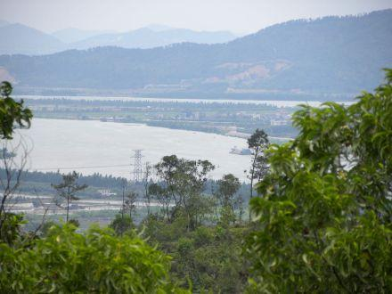

# 中山市卓旗山庄景区

## 景点图片

> 图片来源：[百度百科](https://bkimg.cdn.bcebos.com/pic/2cb4fefe51c6006c5d6008e6?x-bce-process=image/format,f_auto/resize,m_lfit,limit_1,h_330)

## 基本信息

| 项目 | 内容 |
|------|------|
| 景点名称 | 卓旗山庄 |
| 所在城市 | 中山市 |
| 所在区县 | 大涌镇 |
| 景点级别 | 国家3A级旅游景区（2025年11月被取消等级） |
| 景点类型 | 休闲山庄/综合性旅游景区 |
| 开放时间 | 全天开放 |
| 门票价格 | 免费 |

## 景点介绍

卓旗山庄位于广东省中山市大涌镇叠石村卓旗山休闲公园内，是中山市西南部唯一的山水景区，建于1999年，2002年正式对外开放。山庄占地面积约250亩，背依西江，邻近广珠西线高速及古神高速，距中山市区约20分钟车程，是一个集休闲、娱乐、度假、观赏、文化于一体的综合性旅游自然景点。

卓旗山庄于2014年成功申报成为国家3A级旅游景区，是中山市首个配备绿色饭店的民营旅游景点。庄内木刻工艺场的小件木雕被评为"中山市十佳旅游商品"。山庄还曾获评广东省环境教育基地、广东省中医药文化养生旅游示范基地以及中山市唯一的省级森林生态旅游示范基地。

## 景点特点

- **山水景区**：中山市西南部唯一的山水景区，建筑沿山势分布，周围林木茂盛，生态环境良好
- **休闲度假**：配备度假别墅、多功能会议室、山泉水泳池、烧烤场、钓鱼湖等设施
- **红木工艺**：设有红木工艺品展览馆，以大涌红木家具产业为特色
- **自然教育**：设有卓旗山自然学校，开展自然生态教育课程
- **中医药文化**：建有本草涧草药园，让游客了解中医药知识
- **餐饮住宿**：顺德农庄以地道隆都风味和顺德凤城美食为特色，可同时容纳1000人就餐

## 位置

- **地址**：广东省中山市大涌镇叠石村卓旗山休闲公园内
- **经纬度**：22.449°N, 113.298°E

## 交通

- **公交**：乘坐017路、056路、K06路、079路至"卓旗山公园"站下车
- **自驾**：从中山市区沿105国道大涌支线或广珠西线高速大涌出口下，沿指示牌前往

## 数据来源

- [百度百科-卓旗山庄](https://baike.baidu.com/item/%E5%8D%93%E6%97%97%E5%B1%B1%E5%BA%84)

## 最后更新时间

2026-07-19

