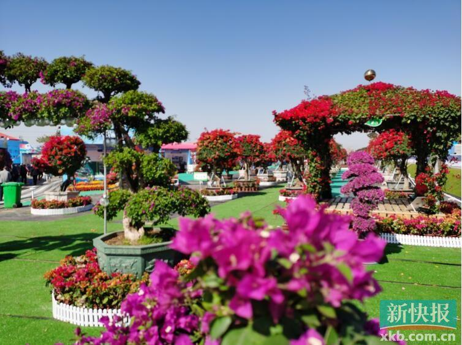

# 横栏花卉世界

## 景点图片

> 图片来源：[新浪网](https://n.sinaimg.cn/sinakd20211203s/517/w754h563/20211203/4d1b-de6c3c9363b91f3436cb674f01219d29.jpg)

## 景点特点

- 华南地区大型花卉交易中心，花卉品种多达数千种
- 四季花开不断，春桃夏荷秋菊冬梅，全年皆有美景可赏
- 集花卉展销、生态观光、休闲体验于一体，功能丰富
- 提供花艺培训、盆栽定制、园林绿化设计等专业服务
- 设有花径步道、观景平台和休闲茶座，适合拍照打卡
- 每年举办花卉展览和花艺大赛，吸引众多游客和摄影爱好者

## 位置

- **地址**：广东省中山市横栏镇花卉世界大道
- **经纬度**：22.5232°N, 113.2658°E

## 交通

- **公交**：乘坐横栏镇内公交线路至花卉世界站下车
- **自驾**：从中山市区沿G105国道向西行驶至横栏镇，沿花卉世界大道即可到达

## 数据来源

- [百度百科-横栏花卉世界](https://baike.baidu.com/item/横栏花卉世界)

## 最后更新时间

2026-07-19

