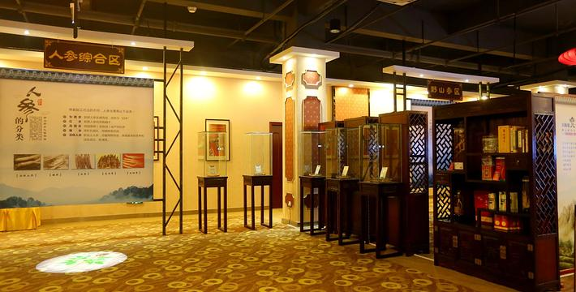

# 中山市参宫野参文化博物馆景区

## 景点图片

> 图片来源：[去哪儿旅行](https://imgs.qunarzz.com/piao_qsight_web_piao_qsight_web/0105t120004hle6owCFE2_R_1600_10000.jpg_710x360_c3a8f6b2.jpg)

## 基本信息

| 项目 | 内容 |
|------|------|
| 景点名称 | 中山市参宫野参文化博物馆景区 |
| 所在城市 | 中山市 |
| 所在区县 | 火炬开发区 |
| 景点级别 | 3A级景区 |
| 景点类型 | 博物馆/文化展示 |
| 开放时间 | 09:00-17:00 |
| 门票价格 | 免费 |

## 景点介绍

中山市参宫野参文化博物馆景区位于广东省中山市火炬开发区，是一座以野参文化为主题的专业博物馆，也是国家AAA级旅游景区。博物馆占地面积约5000平方米，集野参文化展示、科普教育、健康养生于一体，是中国南方地区较为少见的野参文化专题博物馆。

博物馆内设有野参历史文化展区、野参品种展示区、野参生长环境模拟区、野参药用价值科普区等多个功能展区。馆内通过实物标本、图文展板、多媒体互动等多种形式，全面展示了野参的发现历史、品种分类、生长环境、药用价值以及人参文化的深厚底蕴。

参宫野参文化博物馆不仅是一个文化展示场所，也是健康养生知识普及的重要平台。博物馆定期举办健康养生讲座、野参品鉴等活动，向公众传播中医药养生文化知识。景区还设有产品展示区，游客可以了解各类野参产品的特点和功效。

## 景点特点

- **野参文化主题**：以野参文化为主题的专业博物馆，展示野参的发现历史和文化内涵
- **国家3A级景区**：中山市特色文化类旅游景区
- **科普教育功能**：通过实物标本和多媒体互动，普及野参知识和中医药文化
- **健康养生**：定期举办健康养生讲座，传播中医药养生文化
- **免费开放**：对市民和游客免费开放
- **品种丰富**：展示多种野参标本，了解不同品种的特点和功效

## 位置

- **地址**：广东省中山市火炬开发区健康基地
- **经纬度**：22.5585°N, 113.5085°E

## 交通

- **公交**：中山市区乘坐001路、023路、060路公交车至火炬开发区健康基地站下车
- **自驾**：从中山市区沿中山港大道行驶至火炬开发区，按指示牌指引即可到达
- **停车场**：景区设有停车场

## 数据来源

- [中山市文化广电旅游局](https://www.zs.gov.cn/)
- [百度百科-中山市](https://baike.baidu.com/item/%E4%B8%AD%E5%B1%B1%E5%B8%82)

## 最后更新时间

2026-07-19

