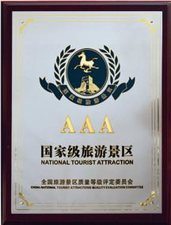

# 中山市咀香园工业旅游景区

## 景点图片

> 图片来源：[百度百科](https://bkimg.cdn.bcebos.com/smart/8326cffc1e178a8246b5b2e0fd03738da877e8e2-bkimg-process,v_1,rw_520,rh_685,maxl_284?x-bce-process=image/format,f_auto)

## 基本信息

| 项目 | 内容 |
|------|------|
| 景点名称 | 中山市咀香园工业旅游景区 |
| 所在城市 | 中山市 |
| 所在区县 | 火炬开发区 |
| 景点级别 | 3A级景区 |
| 景点类型 | 工业旅游 |
| 开放时间 | 09:00-17:00 |
| 门票价格 | 免费 |

## 景点介绍

中山市咀香园工业旅游景区位于广东省中山市火炬开发区，是中山市著名食品企业咀香园食品有限公司打造的工业旅游示范点。咀香园是中山市百年老字号企业，以生产杏仁饼、月饼等传统糕点而闻名，其杏仁饼制作技艺被列入广东省非物质文化遗产名录。

咀香园工业旅游景区围绕食品生产园区，打造了集参观、体验、购物于一体的工业旅游项目。景区内设有咀香园历史文化展览馆，展示咀香园百年发展历程、传统糕点制作工艺和品牌文化。游客可以参观现代化的食品生产车间，近距离了解杏仁饼、月饼等传统糕点的生产流程。

景区还设有DIY体验区，游客可以在专业师傅的指导下，亲手制作杏仁饼等传统糕点，体验传统美食制作的乐趣。此外，景区内设有产品展示和销售区，游客可以品尝和购买咀香园各类糕点产品。

## 景点特点

- **百年老字号**：咀香园是中山市百年食品企业，历史悠久
- **非物质文化遗产**：杏仁饼制作技艺被列入广东省非遗名录
- **工业旅游示范**：展示现代化食品生产流程，了解传统糕点制作工艺
- **DIY体验**：亲手制作杏仁饼等传统糕点，体验美食制作乐趣
- **免费开放**：对市民和游客免费开放
- **购物品尝**：可品尝和购买咀香园各类传统糕点产品

## 位置

- **地址**：广东省中山市火炬开发区咀香园路
- **经纬度**：22.5658°N, 113.5125°E

## 交通

- **公交**：中山市区乘坐001路、023路、060路公交车至火炬开发区咀香园站下车
- **自驾**：从中山市区沿中山港大道行驶至火炬开发区，按指示牌指引即可到达
- **停车场**：景区设有停车场

## 数据来源

- [中山市文化广电旅游局](https://www.zs.gov.cn/)
- [百度百科-咀香园](https://baike.baidu.com/item/%E5%92%80%E9%A6%99%E5%9B%AD)
- [咀香园官方网站](http://www.joeshion.com/)

## 最后更新时间

2026-07-19

