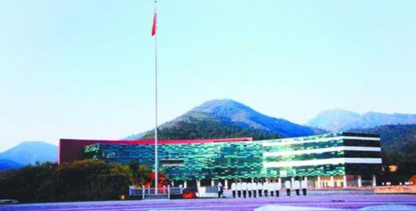

# 中山科技馆

## 景点图片

> 图片来源：[去哪儿旅行](https://imgs.qunarzz.com/sight/p62/201211/02/18cd952dc5f8aefa93835fbb.jpg_710x360_1d31df60.jpg)

## 景点特点

- 中山市最大的综合性科技展馆，展览面积约8000平方米
- 设有200余件互动科普展品，涵盖声光电磁、力学、生物、人工智能等领域
- 专设人工智能和虚拟现实体验区，可体验AI对话和VR沉浸式科普课程
- 展品以互动体验为主，强调动手操作和亲身感受科学原理
- 定期举办科技讲座、科普展览和青少年科技创新大赛等活动
- 免费开放，是中山市重要的科普教育基地和青少年科技启蒙场所

## 位置

- **地址**：广东省中山市火炬开发区科技大道
- **经纬度**：22.3676°N, 113.4434°E

## 交通

- **公交**：乘坐中山市公交线路至中山科技馆站下车
- **自驾**：从中山市区沿G94珠三角环线高速行驶，经火炬开发区出口下，沿科技大道即可到达科技馆

## 数据来源

- [百度百科-中山科技馆](https://baike.baidu.com/item/中山科技馆)

## 最后更新时间

2026-07-19

