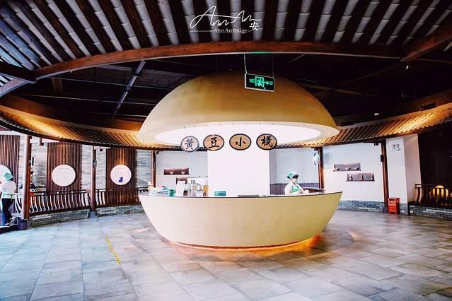

# 厨邦酱油文化博物馆

## 景点图片

> 图片来源：[去哪儿旅行](https://tr-osdcp.qunarzz.com/tr-osd-tr-manager/img/d68e99af44bce8a5b33b0c42c9987e62.jpg_r_640x426x70_02044eaf.jpg)

## 景点特点

- **酱油文化主题**：全面展示中国酱油酿造历史和文化
- **国家3A级景区**：中山市工业旅游代表性景点
- **传统工艺展示**：再现传统酱油酿造技艺全过程
- **现代生产参观**：可参观现代化酱油生产线
- **互动体验**：多媒体互动展示，增加参观趣味性
- **免费开放**：对市民和游客免费开放

## 位置

- **地址**：广东省中山市火炬开发区厨邦路1号
- **经纬度**：22.5707°N, 113.5169°E

## 交通

- **公交**：中山市内乘坐公交至火炬开发区厨邦站下车
- **自驾**：导航至"厨邦酱油文化博物馆"，有停车场

## 数据来源

- [百度百科-厨邦酱油文化博物馆](https://baike.baidu.com/item/%E5%8E%A8%E9%82%A6%E9%85%B1%E6%B2%B9%E6%96%87%E5%8C%96%E5%8D%9A%E7%89%A9%E9%A6%86)

## 最后更新时间

2026-07-19

