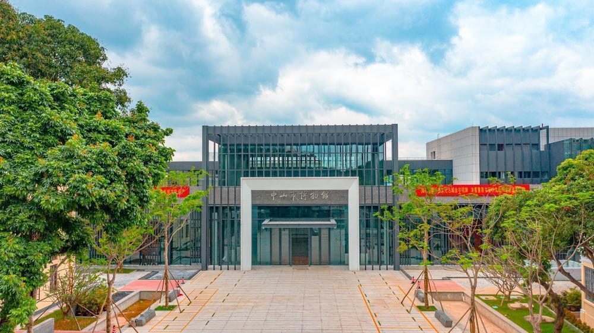

# 中山博物馆

## 景点图片

> 图片来源：[百度百科](https://bkimg.cdn.bcebos.com/pic/d31b0ef41bd5ad6eddc4339ada9d2edbb6fd5266963f?x-bce-process=image/format,f_auto/resize,m_lfit,limit_1,h_719)

## 景点特点

- 中山市最大的综合性博物馆，馆藏文物丰富
- 展示中山市的历史变迁和文化发展，内容丰富
- 定期举办各类展览和文化活动，提供丰富的文化体验
- 免费开放，适合各类游客参观
- 是青少年教育的重要基地，提供教育活动和亲子活动
- 建筑风格现代大气，融合岭南传统建筑元素

## 位置

- **地址**：广东省中山市石岐街道孙文中路197号
- **经纬度**：22.3676°N, 113.4434°E

## 交通

- 公交：中山市区乘坐多路公交车至博物馆站下车
- 自驾：从中山市区沿兴中道行驶即可到达
- 停车场：博物馆设有停车场，可停放各类车辆

## 数据来源

- [中山市文化广电旅游局](https://www.zhongshan.gov.cn/)
- [中山博物馆官方网站](http://www.zsmuseum.cn/)
- [百度百科-中山博物馆](https://baike.baidu.com/item/%E4%B8%AD%E5%B1%B1%E5%8D%9A%E7%89%A9%E9%A6%86)

## 最后更新时间

2026-07-19

