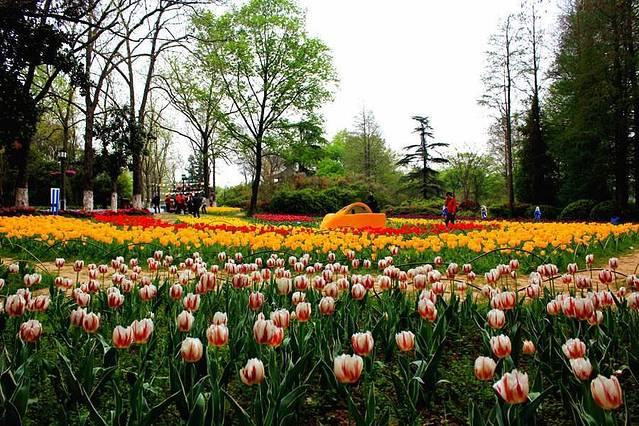

# 中山植物园

## 景点图片

> 图片来源：[去哪儿旅行](https://img1.qunarzz.com/travel/d7/1803/bc/fb47c173b833a6b5.jpg_r_640x426x70_a0cb836a.jpg)

## 景点特点

- **中山市最大的植物园**：占地面积约50公顷
- **热带亚热带植物**：拥有各种植物800多种
- **专类园区**：棕榈园、兰花园、茶花园等
- **免费开放**：中山市民休闲观光的好去处
- **科普教育**：重要的科普教育基地

## 位置

- **地址**：中山市石岐街道中山植物园
- **经纬度**：22.3676°N, 113.4434°E

## 交通

- **公交**：中山市内多路公交可达
- **自驾**：可停放至植物园停车场

## 数据来源

- [百度百科-中山植物园](https://baike.baidu.com/item/中山植物园)

## 最后更新时间

2026-07-19

