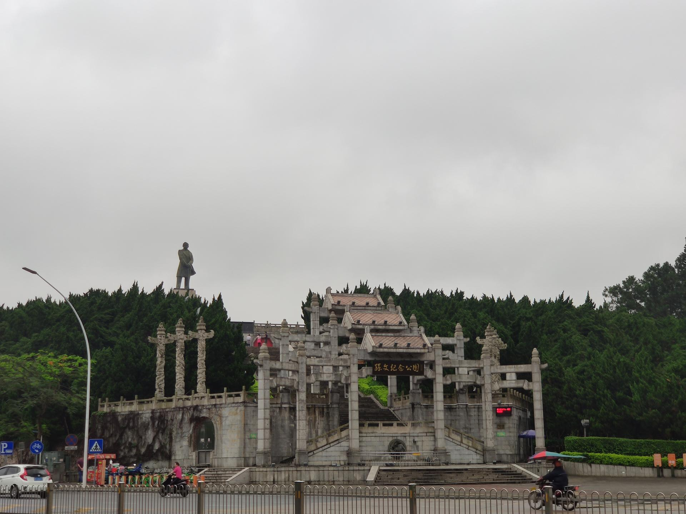

# 孙文纪念公园

## 景点图片

## 景点特点

- **孙中山铜像**：高约12米，矗立山顶
- **纪念性公园**：为纪念孙中山先生而建
- **植物园区**：松园、竹园、杜鹃园等
- **城市绿肺**：中山市民休闲娱乐的重要场所

## 位置

- **地址**：中山市石岐街道兴中道
- **经纬度**：22.4972°N, 113.3883°E

## 交通

- **公交**：中山市内多路公交可达
- **自驾**：可停放至公园停车场

## 数据来源

- [百度百科-孙文纪念公园](https://baike.baidu.com/item/孙文纪念公园)

## 最后更新时间

2026-07-19

