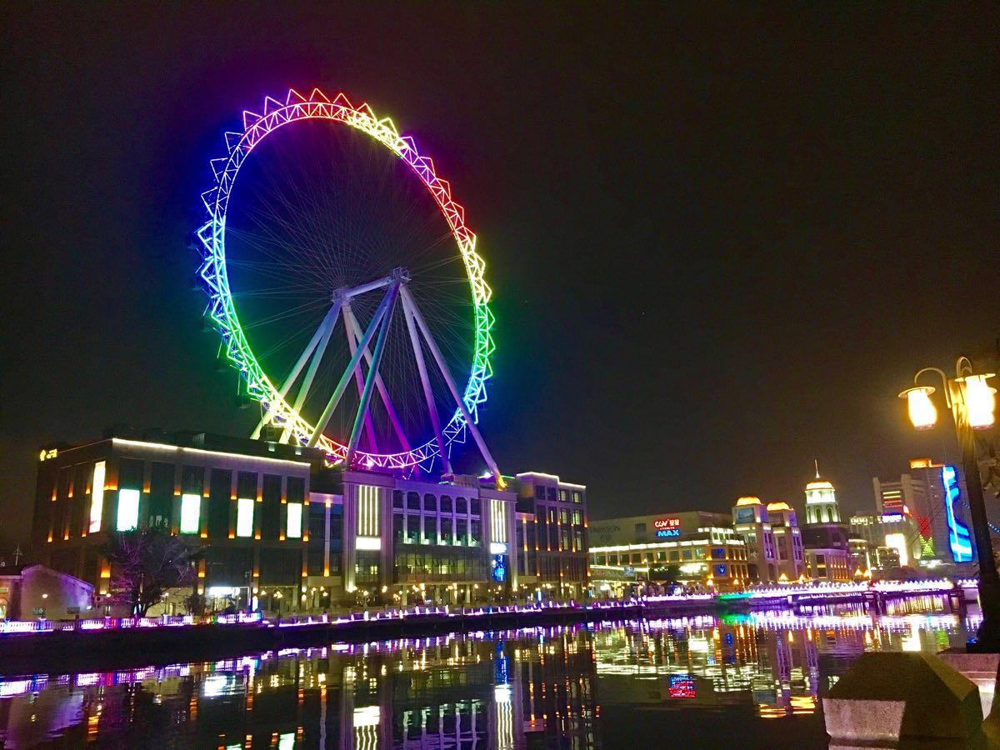

# 幻彩摩天轮

## 景点图片

> 图片来源：[携程攻略](https://youimg1.c-ctrip.com/target/100r0h0000008p19fEF89.jpg)

## 景点介绍

幻彩摩天轮位于广东省中山市石岐街道兴中广场，是中山市标志性城市景观之一，也是珠三角地区著名的摩天轮。摩天轮总高度约108米，轮径约83米，设有36个观景舱，每个观景舱可容纳6-8人，旋转一圈约需20分钟。

幻彩摩天轮坐落于岐江之畔，与岐江公园、孙文西路步行街等景点相邻，共同构成中山市中心城区最具活力的文化旅游区域。乘坐摩天轮缓缓上升，可以360度俯瞰中山市城区全景，远眺岐江蜿蜒流淌，夜晚时分灯光璀璨，景色尤为迷人。

摩天轮安装了先进的LED灯光系统，夜晚可呈现丰富多彩的灯光秀，变幻出各种绚丽图案，成为岐江夜景的点睛之笔。幻彩摩天轮不仅是游客打卡的热门景点，也是中山市民休闲娱乐的好去处。

## 景点特点

- **中山地标**：中山市标志性城市景观，高度约108米
- **岐江之畔**：坐落于岐江边，与周边景点形成文化休闲区
- **360度全景**：可俯瞰中山城区和岐江风光
- **夜景璀璨**：LED灯光秀绚丽多彩，夜晚景色迷人
- **36个观景舱**：每个舱可容纳6-8人，旋转约20分钟
- **城市打卡地**：游客热门打卡景点

## 位置

- **地址**：广东省中山市石岐街道兴中广场
- **经纬度**：22.5802°N, 113.3844°E

## 交通

- **公交**：中山市内乘坐公交至兴中广场站或岐江桥站下车
- **自驾**：导航至"兴中广场"，有停车场

## 数据来源

- [百度百科-幻彩摩天轮](https://baike.baidu.com/item/%E5%B9%BB%E5%BD%A9%E6%91%A9%E5%A4%A9%E8%BD%AE)

## 最后更新时间

2026-07-19
