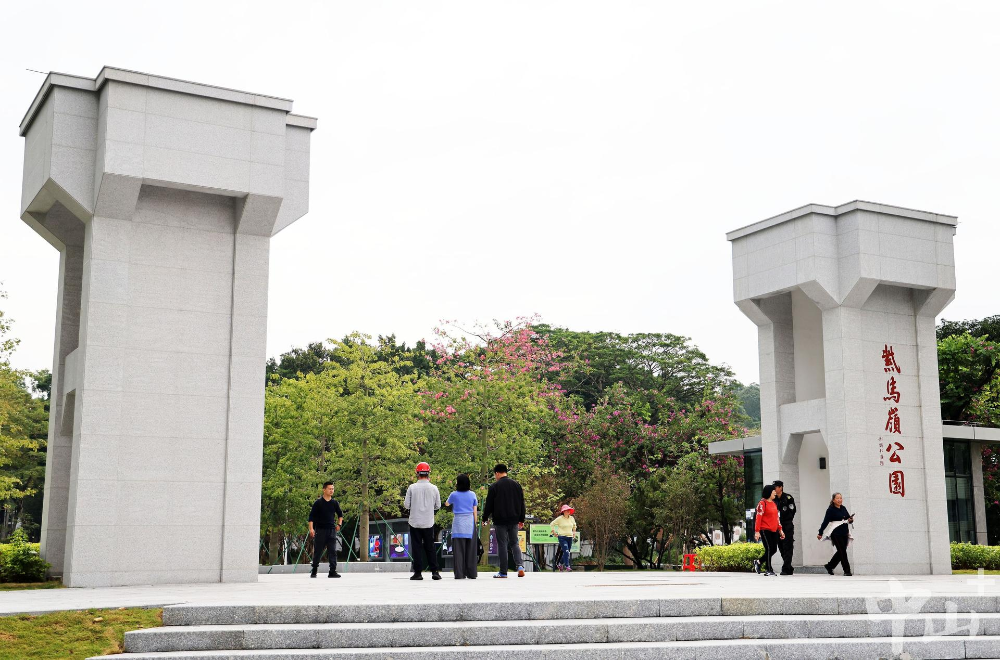

# 马岭公园

## 景点图片

> 图片来源：[zsrbapp.zsnews.cn](https://zsrbapp.zsnews.cn/api-v2/storage/upload/20251114/jXfa9toS8Yv60G05DQ1RcZSRdWAyj2ZpXOvhtDcU.jpg)

## 景点介绍

马岭公园位于广东省中山市石岐街道，是中山市城区内一座风景优美的城市公园。公园占地面积约200亩，绿化覆盖率达85%以上，是中山市重要的生态绿肺和市民休闲场所。

马岭公园建于1980年代，经过多年的建设和发展，已成为中山市最具代表性的城市公园之一。公园依山而建，地形起伏，绿树成荫，花香四溢。园内设有多个主题区域，包括儿童游乐区、健身区、花卉观赏区等，满足不同年龄段游客的需求。

马岭公园不仅是市民休闲健身的好去处，也是中山市重要的文化活动场所。公园内定期举办各类文化活动和节庆活动，如春节花卉展览、中秋赏月活动等，吸引了大量市民和游客参与。同时，公园也是摄影爱好者的天堂，四季皆有不同的美景。

## 景点特点

- 中山市城区内风景优美的城市公园，绿化覆盖率高
- 依山而建，地形起伏，绿树成荫，环境优美
- 设有多个主题区域，满足不同年龄段游客的需求
- 定期举办各类文化活动和节庆活动，内容丰富
- 免费开放，适合市民日常休闲和游客参观
- 是摄影爱好者的天堂，四季皆有不同的美景

## 位置

- **地址**：广东省中山市石岐街道博爱六路
- **经纬度**：22.4535°N, 113.3482°E

## 交通

- 公交：中山市区乘坐多路公交车至马岭公园站下车
- 自驾：从中山市区沿马岭路行驶即可到达
- 停车场：公园设有停车场，可停放各类车辆

## 数据来源

- [中山市城市管理和综合执法局](http://www.zs.gov.cn/csglj/)
- [百度百科-马岭公园](https://baike.baidu.com/item/%E9%A9%AC%E5%B2%AD%E5%85%AC%E5%9B%AD)

## 最后更新时间

2026-07-19

