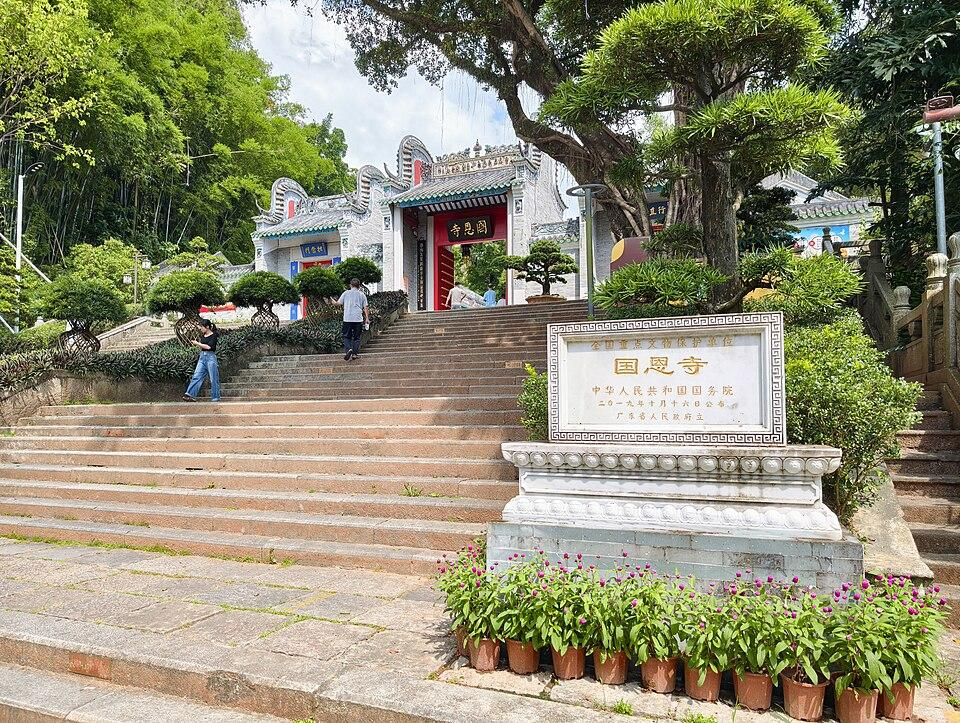

# 国恩寺

## 景点图片

> 图片来源：[Wikimedia Commons](https://commons.wikimedia.org/wiki/File:%E5%9B%BD%E6%81%A9%E5%AF%BA%2020260527%20144925.jpg) · 许可证：CC BY-SA 4.0

## 基本信息

| 项目 | 内容 |
|------|------|
| 景点名称 | 国恩寺 |
| 所在城市 | 云浮市 |
| 所在区县 | 新兴县 |
| 景点级别 | 广东省文物保护单位 |
| 景点类型 | 寺庙 |
| 开放时间 | 08:00-17:30 |
| 门票价格 | 免费 |

## 景点介绍

国恩寺位于广东省云浮市新兴县六祖镇，始建于唐代，是禅宗六祖惠能大师的故居和圆寂之地，被誉为"岭南第一圣域"和"中国禅文化的发祥地"。国恩寺原名"报恩寺"，唐中宗神龙三年（公元707年）赐名为"国恩寺"。

国恩寺依山而建，占地面积约10万平方米，寺内保存有六祖惠能手植的千年古荔、六祖父母坟、六祖真身像等珍贵文物古迹。寺内建筑群包括山门、天王殿、大雄宝殿、六祖殿、观音殿等，气势恢宏，庄严肃穆。每年农历二月初八和八月初三的六祖诞辰纪念日，都会举行盛大的法会活动。

## 景点特点

- **禅宗祖庭**：是禅宗六祖惠能大师的故居和圆寂之地，是禅宗文化的核心圣地
- **千年古荔**：寺内保存有六祖惠能亲手种植的古荔枝树，距今已逾千年
- **珍贵文物**：寺内藏有六祖真身像、武则天御赐匾额等珍贵历史文物
- **六祖文化**：每年举办六祖诞辰纪念活动，吸引海内外信众前来朝拜
- **古建筑群**：保存有唐宋以来的多处古建筑，建筑风格古朴典雅
- **自然环境**：寺院依山傍水，古木参天，环境清幽

## 位置

- **地址**：广东省云浮市新兴县六祖镇国恩寺
- **经纬度**：22.5896°N, 112.2281°E

## 交通

- **高铁**：云浮东站下车后转乘公交或出租车前往，车程约1小时
- **公交**：新兴县城乘坐前往六祖镇的公交车，在国恩寺站下车
- **自驾**：广明高速新兴出口下，沿S276省道行驶至六祖镇，约30分钟

## 数据来源

- [新兴县人民政府官网](http://www.xinxing.gov.cn/)

## 最后更新时间

2026-06-20
