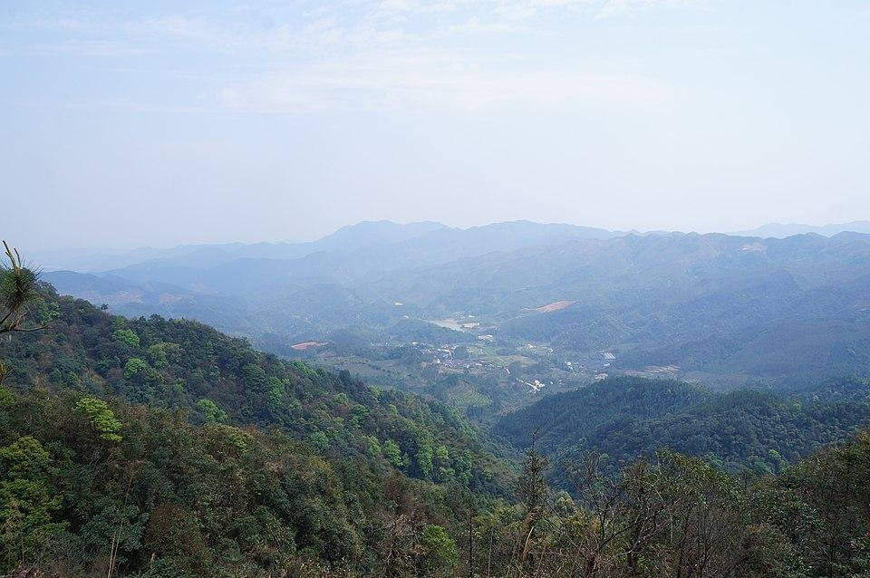

# 天露山

## 景点图片

> 图片来源：[Wikimedia Commons](https://commons.wikimedia.org/wiki/File:%E5%A4%A9%E9%9C%B2%E5%B1%B1%E8%B6%8A%E9%87%8E%E7%A9%BF%E8%B6%8A20160326%20-%20panoramio.jpg) · 许可证：CC BY-SA 4.0

## 基本信息

| 项目 | 内容 |
|------|------|
| 景点名称 | 天露山 |
| 所在城市 | 云浮市 |
| 所在区县 | 新兴县 |
| 景点级别 | 4A级景区 |
| 景点类型 | 风景区 |
| 开放时间 | 08:00-17:30 |
| 门票价格 | 约50元 |

## 景点介绍

天露山位于广东省云浮市新兴县，是新兴县境内的最高峰，海拔1251米。天露山因山上终年云雾缭绕、山顶常有甘露而得名，是省级自然保护区和国家森林公园。

天露山自然生态环境优越，拥有丰富的动植物资源，山中古木参天、溪流潺潺、飞瀑成群，四季景色各异。山上建有禅龙峡漂流、空中飞人、玻璃桥等游乐项目，是集自然风光、休闲度假、户外探险于一体的综合性旅游景区。

## 景点特点

- **天然氧吧**：森林覆盖率达96%以上，空气中负离子含量极高，是天然的养生胜地
- **高山草甸**：山顶分布着大面积的高山草甸，视野开阔，可远眺珠三角城市群
- **禅龙峡漂流**：落差大、水流急，是广东省内极具挑战性的漂流项目
- **温泉养生**：景区周边拥有丰富的地热温泉资源，可体验休闲养生
- **佛教文化**：山上有多处佛教遗址，文化底蕴深厚
- **四季花海**：不同季节有不同的花卉盛开，尤其以冬季梅花著称

## 位置

- **地址**：广东省云浮市新兴县里洞镇天露山旅游度假区
- **经纬度**：22.4891°N, 112.2227°E

## 交通

- **高铁**：云浮东站下车后转乘公交或出租车前往，车程约1.5小时
- **公交**：新兴县城乘坐旅游专线车前往天露山
- **自驾**：广明高速新兴出口下，沿S276省道行驶至里洞镇，约40分钟

## 数据来源

- [天露山旅游度假区官方网站](https://www.tianlushan.com/)

## 最后更新时间

2026-06-20
