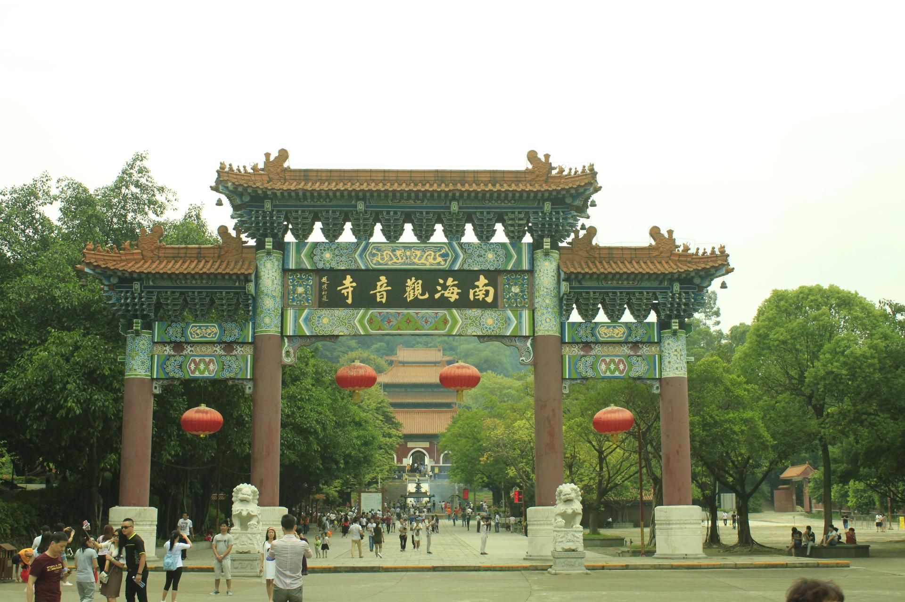

# 南海观音寺

## 景点图片

> 图片来源：[Wikimedia Commons](https://commons.wikimedia.org/wiki/File:Paifang,_Nanhai_Guanyin_Temple,_Foshan,_Guangdong,_China,_picture6.jpg) · 许可证：CC BY-SA 4.0

## 基本信息

| 项目 | 内容 |
|------|------|
| 景点名称 | 南海观音寺 |
| 所在城市 | 佛山市 |
| 所在区县 | 南海区 |
| 景点级别 | 无 |
| 景点类型 | 宗教文化景区 |
| 开放时间 | 08:00-17:30（周一至周日） |
| 门票价格 | 免费（含在西樵山门票内） |

## 景点介绍

南海观音寺位于佛山市南海区西樵山风景区内，始建于东晋，距今有1600多年历史。寺内有观音像、大雄宝殿、天王殿等建筑，是珠三角地区重要的佛教活动场所。

观音寺依山而建，环境清幽，古木参天。寺内的观音铜像高约12米，庄严慈祥，是西樵山的标志性景观之一。每逢观音诞辰等佛教节日，前来朝拜的信众络绎不绝。

## 景点特点

- **历史悠久**：始建于东晋，距今1600多年历史
- **佛教圣地**：是珠三角地区重要的佛教活动场所
- **建筑宏伟**：有观音像、大雄宝殿等宏伟建筑
- **环境清幽**：依山而建，古木参天，空气清新

## 位置

- **地址**：佛山市南海区西樵山风景区内
- **经纬度**：23.1757°N, 113.1087°E## 交通

- **自驾**：广明高速西樵出口下，沿西樵山方向行驶约10分钟
- **公交**：佛山市区乘坐公交至西樵山站

## 数据来源

- [百度百科-佛山市](https://baike.baidu.com/item/%E4%BD%9B%E5%B1%B1%E5%B8%82)

## 最后更新时间

2026-06-25
