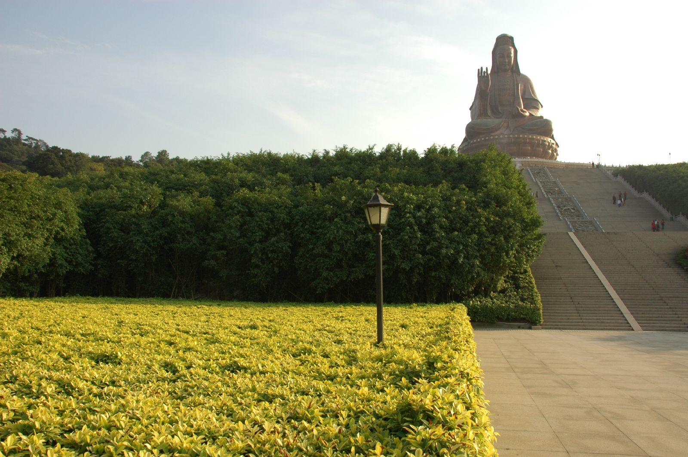

# 西樵山

## 景点图片

> 图片来源：[Wikimedia Commons](https://commons.wikimedia.org/wiki/File:Xiqiao_mountain.jpg) · 许可证：CC BY-SA 4.0

## 基本信息

| 项目 | 内容 |
|------|------|
| 景点名称 | 西樵山 |
| 所在城市 | 佛山市 |
| 所在区县 | 南海区 |
| 景点级别 | 5A级景区 |
| 景点类型 | 风景区 |
| 开放时间 | 07:30-17:30 |
| 门票价格 | 70元 |

## 景点介绍

西樵山位于佛山市南海区西樵镇，是广东四大名山之一，国家5A级旅游景区。西樵山总面积约14平方公里，海拔346米，是一座具有四五千万年历史的死火山。山上有72峰、36洞、28处瀑布和众多名胜古迹，素有"岭南佳境"之美誉。

西樵山不仅是自然风光秀美的风景区，更是南粤文化的发祥地之一。明清时期，西樵山是南方理学名山，大批文人学者在此讲学论道，留下了丰富的文化遗产。山上的白云洞、三湖书院、无叶井等景点文化底蕴深厚。

## 景点特点

- **岭南名山**：广东四大名山之一，具有独特的火山地貌
- **自然景观丰富**：72峰竞秀，36洞探幽，瀑布飞泻，湖水清澈
- **文化底蕴深厚**：南粤理学名山，三湖书院等文化遗迹众多
- **西樵山观音铜像**：世界最高的铜造观音坐像，高达61.9米
- **四季皆宜**：春天桃花、夏天瀑布、秋天红叶、冬天云海

## 位置

- **地址**：佛山市南海区西樵镇西樵山风景区
- **经纬度**：22.9241°N, 112.9772°E

## 交通

- **公交**：乘坐樵01、樵02路公交至西樵山站
- **自驾**：佛开高速西樵出口，按指示牌行驶至西樵山
- **旅游专线**：佛山汽车站有直达西樵山的旅游巴士

## 数据来源

- [百度百科 - 西樵山](https://baike.baidu.com/item/西樵山)

## 最后更新时间

2026-06-20
