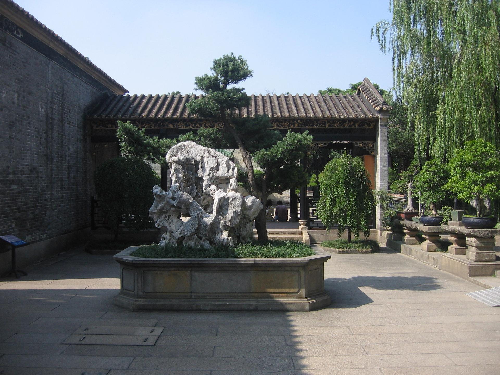

# 佛山梁园

## 景点图片

> 图片来源：[Wikimedia Commons](https://commons.wikimedia.org/wiki/File:%E6%A2%81%E5%9B%AD.jpg) · 许可证：CC BY-SA 4.0

## 基本信息

| 项目 | 内容 |
|------|------|
| 景点名称 | 佛山梁园 |
| 所在城市 | 佛山市 |
| 所在区县 | 禅城区 |
| 景点级别 | - |
| 景点类型 | 历史园林 |
| 开放时间 | 09:00-17:00（周一闭园） |
| 门票价格 | 免费 |

## 景点介绍

梁园位于佛山市禅城区松风路，始建于清嘉庆年间（1796-1820年），由梁氏家族的梁蔼如、梁九章、梁九华、梁九图等叔侄四人历时40余年建造。梁园是清代岭南文人园林的典型代表，与清晖园、余荫山房、可园并称为广东四大名园。

梁园占地面积约21260平方米，园林布局以松、竹、柳为主要植物配置，辅以湖水、假山、奇石，营造出疏朗清新、文雅脱俗的岭南园林意境。园内保存有大量珍贵的岭南建筑和石刻文物。

## 景点特点

- **广东四大名园之一**：与清晖园、余荫山房、可园齐名
- **文人园林**：体现岭南文人的审美情趣和文化追求
- **奇石收藏**：园内收藏有大量珍贵的太湖石和英石
- **植物配置**：以松、竹、柳为特色，四季景色各异
- **免费开放**：面向公众免费开放，是市民休闲好去处

## 位置

- **地址**：佛山市禅城区松风路先锋古道93号
- **经纬度**：23.0382°N, 113.1133°E

## 交通

- **地铁**：广佛线祖庙站，步行约10分钟
- **公交**：101路、105路等至梁园站
- **自驾**：可停放在梁园周边停车场

## 数据来源

- [梁园官方网站](https://www.fsmuseum.com/)

## 最后更新时间

2026-06-20
