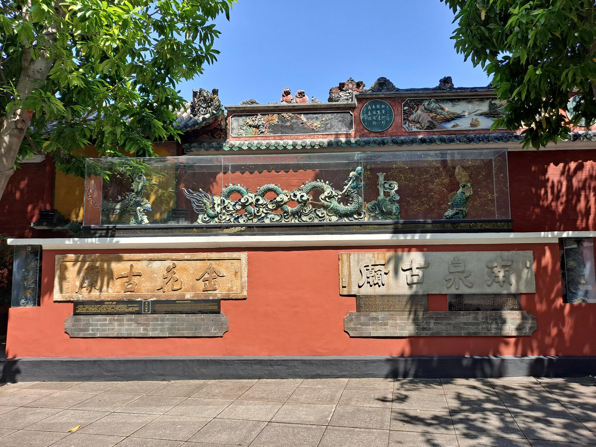

# 佛山祖庙

## 景点图片

> 图片来源：[Wikimedia Commons](https://commons.wikimedia.org/wiki/File:Foshan_Ancestral_Temple_9.jpg) · 许可证：CC BY-SA 4.0

## 基本信息

| 项目 | 内容 |
|------|------|
| 景点名称 | 佛山祖庙 |
| 所在城市 | 佛山市 |
| 所在区县 | 禅城区 |
| 景点级别 | 4A级景区 |
| 景点类型 | 历史建筑 |
| 开放时间 | 08:30-18:00 |
| 门票价格 | 20元 |

## 景点介绍

佛山祖庙位于佛山市禅城区祖庙路，始建于北宋元丰年间（1078-1085年），是供奉北帝的神庙，也是明清时期佛山的政治、宗教和文化中心。祖庙占地面积约3000平方米，是全国重点文物保护单位。

祖庙建筑群包括前殿、正殿、后殿、牌坊、钟鼓楼等，集古代建筑、雕刻、铸造艺术于一体，被誉为"东方艺术之宫"。庙内保存有大量精美的陶塑、木雕、砖雕和铜铁铸件，具有极高的艺术价值。

## 景点特点

- **古建筑瑰宝**：岭南地区保存最完整、最具代表性的古代建筑群之一
- **北帝信仰**：佛山民间信仰的核心场所，每年北帝诞活动盛大
- **陶塑艺术**：屋脊上的石湾陶塑栩栩如生，色彩斑斓
- **武术文化**：黄飞鸿纪念馆和叶问堂坐落于此，展示佛山武术文化
- **传统工艺**：木雕、砖雕、石雕等岭南传统工艺精华荟萃

## 位置

- **地址**：佛山市禅城区祖庙路21号
- **经纬度**：23.1169°N, 113.0659°E

## 交通

- **地铁**：广佛线祖庙站D出口，步行约5分钟
- **公交**：101路、105路、106路等至祖庙站
- **自驾**：可停放在祖庙周边停车场

## 数据来源

- [佛山祖庙博物馆官方网站](https://www.fsmuseum.com/)

## 最后更新时间

2026-06-20
