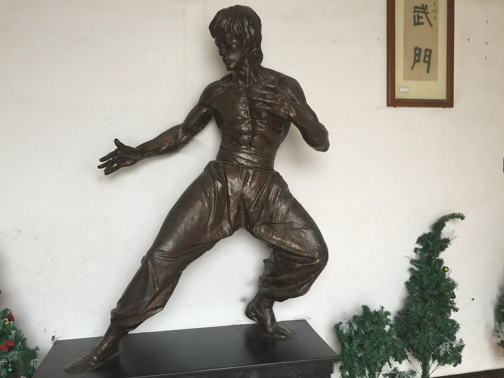

# 李小龙乐园

## 景点图片

> 图片来源：[Flickr](https://www.flickr.com/photos/9036889@N06/25635220191) · 作者：milst1 · 许可证：[CC BY-SA 2.0](https://creativecommons.org/licenses/by-sa/2.0/)

## 基本信息

| 项目 | 内容 |
|------|------|
| 景点名称 | 李小龙乐园 |
| 所在城市 | 佛山市 |
| 所在区县 | 顺德区 |
| 景点级别 | 4A级景区 |
| 景点类型 | 主题公园 |
| 开放时间 | 09:00-17:30 |
| 门票价格 | 约60元 |

## 景点介绍

李小龙乐园位于佛山市顺德区均安镇，是为纪念国际功夫巨星李小龙而建设的专题文化旅游景区。乐园占地约10万平方米，依托李小龙故居和李小龙纪念馆，集生平事迹展示、武术表演、生态观光、休闲娱乐于一体，是全球李小龙粉丝和武术爱好者的朝圣之地。

均安镇是李小龙的祖籍地和童年生活过的地方，李小龙的父亲李海泉就是出生于均安。乐园内有李小龙铜像、纪念馆、故居、武术训练场等多个景点，全方位展示李小龙的生平事迹和武术精神。

## 景点特点

- **功夫文化圣地**：全球李小龙粉丝的朝圣之地，具有独特的文化魅力
- **李小龙纪念馆**：展示李小龙生平照片、电影道具、手稿等珍贵文物
- **李小龙铜像**：高大的李小龙练功铜像，气势磅礴，是标志性景观
- **武术表演**：定时进行截拳道等武术表演，精彩纷呈
- **生态园区**：园内绿树成荫，有湖泊和小桥流水，环境宜人
- **李小龙故居**：还原李小龙童年生活的场景，感受功夫巨星的成长环境

## 位置

- **地址**：佛山市顺德区均安镇李小龙乐园路
- **经纬度**：22.7174°N, 113.1246°E

## 交通

- **公交**：顺德区内乘坐公交至均安镇李小龙乐园站
- **自驾**：从广州市区出发约1小时车程，导航"李小龙乐园"
- **旅游专线**：顺德城区有直达均安镇的旅游巴士

## 数据来源

- [百度百科 - 李小龙乐园](https://baike.baidu.com/item/李小龙乐园)

## 最后更新时间

2026-07-11
