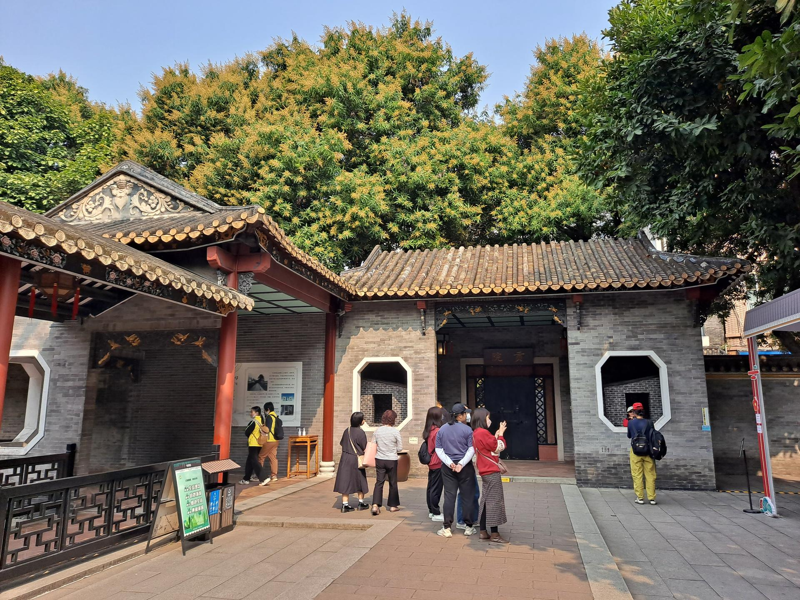

# 清晖园

## 景点图片

> 图片来源：[Wikimedia Commons](https://commons.wikimedia.org/wiki/File:Qinghui_Garden_11.jpg) · 许可证：CC BY-SA 4.0

## 基本信息

| 项目 | 内容 |
|------|------|
| 景点名称 | 清晖园 |
| 所在城市 | 佛山市 |
| 所在区县 | 顺德区 |
| 景点级别 | - |
| 景点类型 | 历史园林 |
| 开放时间 | 08:00-18:00 |
| 门票价格 | 15元 |

## 景点介绍

清晖园位于佛山市顺德区大良街道，始建于明代天启年间（1621-1627年），原为明代状元黄士俊的私人花园。清乾隆年间（1736-1795年）由进士龙应时购得，后经龙家数代人精心营建，成为岭南园林的杰出代表。

清晖园占地面积约22000平方米，是广东四大名园之一。园内建筑精巧，布局紧凑，以小巧玲珑、雅致清幽著称。园内保存有大量清代岭南建筑和装饰艺术精品，包括精美的灰塑、木雕、砖雕等，具有极高的历史和艺术价值。

## 景点特点

- **广东四大名园之首**：规模最大、保存最完整的岭南园林之一
- **明清建筑精华**：集明清两代岭南建筑艺术之大成
- **园林布局精巧**：以"步移景异"著称，处处有景
- **装饰艺术精湛**：灰塑、木雕、砖雕等工艺精湛绝伦
- **文化底蕴深厚**：承载着顺德龙家数百年的人文历史

## 位置

- **地址**：佛山市顺德区大良街道清晖路16号
- **经纬度**：22.8255°N, 113.2405°E

## 交通

- **地铁**：佛山地铁3号线大良站，步行约15分钟
- **公交**：301路、305路等至清晖园站
- **自驾**：可停放在清晖园周边停车场

## 数据来源

- [清晖园官方网站](http://www.qinghuiyuan.com/)

## 最后更新时间

2026-06-20
