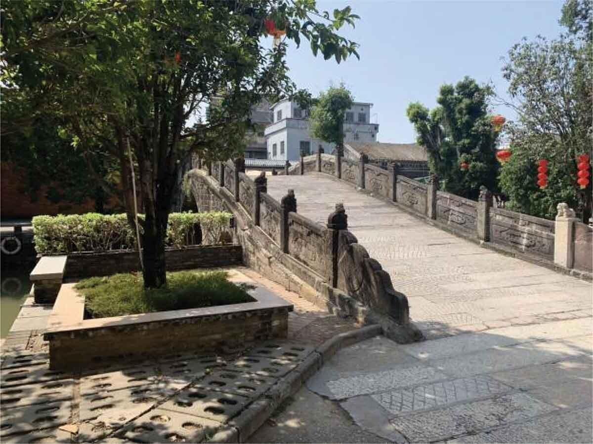

# 逢简水乡

## 景点图片

> 图片来源：[Wikimedia Commons](https://commons.wikimedia.org/wiki/File:Mingyuan_bridge_in_Fengjian_village.jpg) · 许可证：CC BY-SA 4.0

## 基本信息

| 项目 | 内容 |
|------|------|
| 景点名称 | 逢简水乡 |
| 所在城市 | 佛山市 |
| 所在区县 | 顺德区 |
| 景点级别 | 3A级景区 |
| 景点类型 | 历史文化村落 |
| 开放时间 | 全天开放 |
| 门票价格 | 免费 |

## 景点介绍

逢简水乡位于佛山市顺德区杏坛镇，是岭南地区最具代表性的水乡古村落之一，有"广东周庄"之美誉。逢简水乡历史悠久，始建于西汉时期，至今已有两千多年的历史。村内水道纵横，古桥众多，保留着大量明清时期的古建筑和岭南传统民居。

逢简水乡面积约14平方公里，村内有石桥70多座，其中最著名的是始建于宋代的明远桥和巨济桥。水乡河道两旁古榕参天，石板古巷蜿蜒曲折，处处散发着岭南水乡的古朴韵味。游客可以乘坐小船穿梭于水道之间，感受岭南水乡的独特风情。

逢简水乡还是美食爱好者的天堂，这里的顺德美食远近闻名，尤其是均安蒸猪、伦教糕、双皮奶等传统美食，吸引着众多食客前来品尝。

## 景点特点

- **岭南水乡典范**：有"广东周庄"之美誉，岭南地区最具代表性的水乡古村落
- **古桥众多**：村内有石桥70多座，包括宋代的明远桥和巨济桥
- **历史悠久**：始建于西汉时期，至今已有两千多年历史
- **小船游览**：可乘坐小船穿梭于水道之间
- **顺德美食**：均安蒸猪、伦教糕、双皮奶等传统美食

## 位置

- **地址**：佛山市顺德区杏坛镇逢简村
- **经纬度**：22.8136°N, 113.1543°E

## 交通

- **公交**：佛山市内公交至逢简水乡站
- **自驾**：可停放至逢简水乡停车场

## 数据来源

- [百度百科-逢简水乡](https://baike.baidu.com/item/逢简水乡)

## 最后更新时间

2026-06-20
