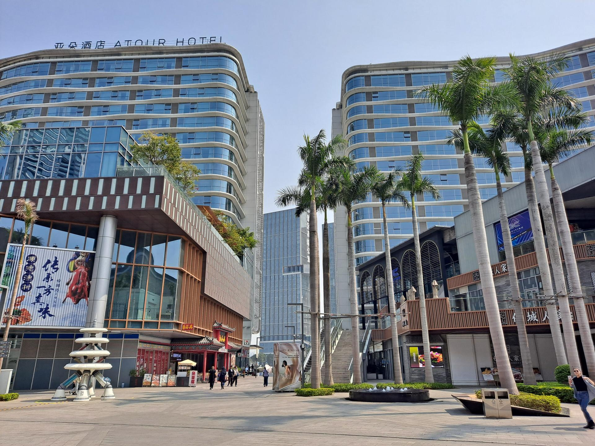

# 顺德华侨城欢乐海岸PLUS

## 景点图片

> 图片拍摄于 2023-03-02。来源：[Wikimedia Commons](https://commons.wikimedia.org/wiki/File:Shunde_OCT_Harbour_PLUS.jpg) · 作者：EditQ · 许可证：[CC BY-SA 4.0](https://creativecommons.org/licenses/by-sa/4.0/)

## 基本信息

| 项目 | 内容 |
|------|------|
| 景点名称 | 顺德华侨城欢乐海岸PLUS |
| 所在城市 | 佛山市 |
| 所在区县 | 顺德区 |
| 景点级别 | 4A级景区 |
| 景点类型 | 文旅综合体、主题公园 |
| 开放时间 | 各园区及项目开放时间不同，以景区当日公告为准 |
| 门票价格 | 公共区域开放，游乐项目及主题公园另行收费 |

## 景点介绍

顺德华侨城欢乐海岸PLUS位于佛山市顺德区大良街道，是融合主题公园、主题商业和生态湿地的文旅综合项目。项目规划占地约3.36平方公里，包含欢乐时光主题公园、玛雅海滩水公园、曲水湾风情商业街及湿地公园等区域。

景区把岭南文化、顺德美食与现代游乐设施结合，既适合家庭游乐，也可进行城市休闲、餐饮购物和夜间观光。

## 景点特点

- **顺德眼摩天轮**：景区代表性城市景观，可俯瞰周边城区
- **多业态融合**：主题游乐、商业街区、餐饮和生态湿地集中分布
- **顺德美食体验**：汇集本地餐饮和顺德饮食文化展示
- **公共交通便利**：佛山地铁3号线设顺德欢乐海岸站

## 位置

- **地址**：佛山市顺德区大良街道欢乐大道1号欢乐海岸PLUS

## 交通

- **地铁**：乘坐佛山地铁3号线至顺德欢乐海岸站
- **公交**：可乘顺德区内公交至欢乐海岸PLUS周边站点
- **自驾**：导航“顺德华侨城欢乐海岸PLUS”，按现场指引停车

## 数据来源

- [顺德华侨城欢乐海岸PLUS官方网站](https://www.octharbourplus.com/)
- [景区交通指南](https://www.octharbourplus.com/frmtrafficGuide.aspx)

## 最后更新时间

2026-07-15
