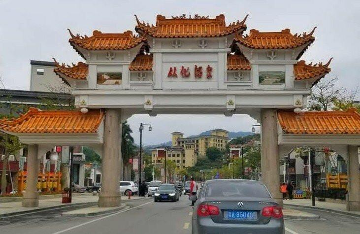

# 从化温泉风景区

## 景点图片

## 基本信息

| 项目 | 内容 |
|------|------|
| 景点名称 | 从化温泉风景区 |
| 所在城市 | 广州市 |
| 所在区县 | 从化区 |
| 景点级别 | 国家级风景名胜区 |
| 景点类型 | 温泉度假区 |
| 开放时间 | 全天开放（各温泉酒店营业时间各异） |
| 门票价格 | 免费进入（各温泉酒店单独收费） |

## 景点介绍

从化温泉风景区位于广州市从化区温泉镇，是国家级风景名胜区，也是中国著名的温泉旅游目的地之一。从化温泉水质优良，属于世界珍稀的含氡小苏打温泉，出水温度高达72℃，富含多种对人体有益的矿物质和微量元素。

从化温泉风景区总面积约20平方公里，以流溪河为轴线，两岸温泉酒店和度假村林立。区内设有温泉广场、温泉博物馆、温泉眼等公共设施。温泉广场上有多处天然温泉眼，游客可免费观赏。

从化温泉已有800多年的开发利用历史，明清时期就是著名的温泉疗养胜地。如今，从化温泉已成为集温泉养生、休闲度假、商务会议于一体的综合性旅游度假区。

## 景点特点

- **国家级风景名胜区**：中国著名温泉旅游目的地
- **世界珍稀温泉**：含氡小苏打温泉
- **800年历史**：明清时期即为温泉疗养胜地
- **流溪河畔**：自然环境优美
- **免费进入**：各温泉酒店单独收费
- **温泉广场**：可免费观赏天然温泉眼

## 位置

- **地址**：广州市从化区温泉镇
- **经纬度**：23.6365°N, 113.6483°E

## 交通

- **地铁**：14号线从化客运站，转乘从化温泉方向公交
- **公交**：从化汽车站转乘温泉方向班车
- **自驾**：经大广高速至从化温泉出口

## 数据来源

- [百度百科-从化温泉](https://baike.baidu.com/item/从化温泉)

## 最后更新时间

2026-06-25
