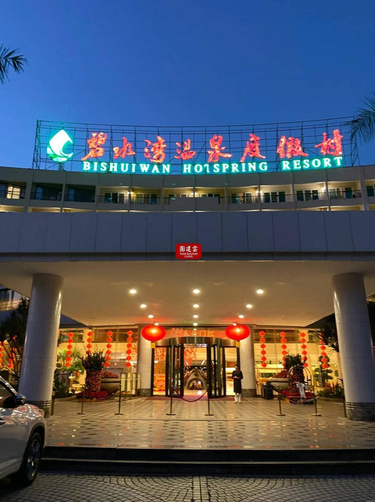

# 碧水湾温泉度假区

## 景点图片

## 基本信息

| 项目 | 内容 |
|------|------|
| 景点名称 | 碧水湾温泉度假区 |
| 所在城市 | 广州市 |
| 所在区县 | 从化区 |
| 景点级别 | 4A级景区 |
| 景点类型 | 温泉度假区 |
| 开放时间 | 09:00-23:00 |
| 门票价格 | 168元/人（温泉票） |

## 景点介绍

碧水湾温泉度假区位于广州市从化区良口镇流溪河畔，是国家AAAA级旅游景区，也是从化温泉旅游度假区的核心组成部分。度假区占地约300亩，依山傍水，环境清幽。

碧水湾温泉水质优良，属于世界珍稀的小苏打温泉，出水温度高达72℃，富含多种对人体有益的矿物质和微量元素。度假区内设有30多个大小不同、功能各异的温泉泡池，包括花瓣池、药浴池、鱼疗池、石板浴等。

除温泉外，度假区还设有客房、餐厅、会议室、网球场、烧烤场等配套设施，是集温泉养生、休闲度假、商务会议于一体的综合性度假胜地。

## 景点特点

- **世界珍稀小苏打温泉**：水质优良，富含多种矿物质
- **30多个温泉泡池**：功能各异，选择丰富
- **流溪河畔**：依山傍水，自然环境优美
- **4A级景区**：服务设施完善
- **四季皆宜**：冬季泡汤尤为舒适

## 位置

- **地址**：广州市从化区良口镇御泉大道353号
- **经纬度**：23.6500°N, 113.7833°E

## 交通

- **地铁**：14号线从化客运站，转乘公交
- **公交**：从化汽车站转乘良口方向班车
- **自驾**：经大广高速或京珠高速至良口出口

## 数据来源

- [百度百科-碧水湾温泉度假区](https://baike.baidu.com/item/碧水湾温泉度假区)

## 最后更新时间

2026-06-25
