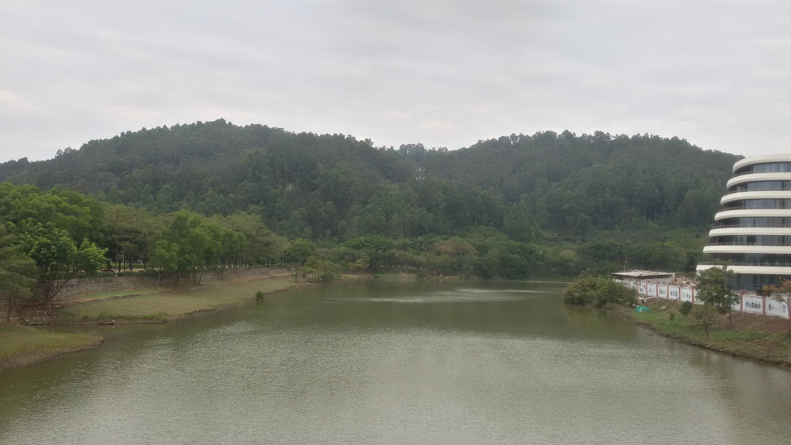

# 南沙滨海公园

## 景点图片

## 基本信息

| 项目 | 内容 |
|------|------|
| 景点名称 | 南沙滨海公园 |
| 所在城市 | 广州市 |
| 所在区县 | 南沙区 |
| 景点级别 | - |
| 景点类型 | 滨海公园 |
| 开放时间 | 全天开放 |
| 门票价格 | 免费 |

## 景点介绍

南沙滨海公园位于广州市南沙区港湾街道，濒临珠江出海口，拥有约20公里的优美海岸线。公园以南沙湾为中心，沿滨海大道向南北延伸，是广州市规模最大的滨海休闲公园之一。

公园依托南沙优越的自然海岸资源而建，集海滨观光、休闲娱乐、运动健身于一体。园内设有滨海步道、自行车道、观景平台、儿童游乐区等功能区域，满足不同游客的需求。漫步在滨海步道上，可以看到繁忙的珠江航道、远眺虎门大桥的雄姿，感受海风拂面的惬意。

南沙滨海公园是广州"蓝色湾区"建设的重要成果，也是南沙打造滨海城市形象的核心景观带。公园与蒲洲花园、南沙天后宫、南沙客运港等景点相邻，形成了南沙湾滨海旅游的完整游览动线。

## 景点特点

- **20公里海岸线**：广州最长的滨海景观带，视野开阔
- **远眺虎门大桥**：在公园观景台可清晰看到虎门大桥的壮丽景观
- **滨海步道与骑行道**：设有专门的散步和骑行道路系统
- **珠江出海口**：位于珠江入海口，可观赏繁忙的航道景象
- **免费开放**：全天候免费向公众开放
- **亲子友好**：设有儿童游乐区和亲水平台

## 位置

- **地址**：广州市南沙区港湾街道滨海大道（南沙天后宫南侧）
- **经纬度**：22.7580°N, 113.6150°E

## 交通

- **地铁**：4号线南沙客运港站，出站步行约20分钟
- **公交**：南沙3路、南沙5路、南沙18路等至南沙滨海公园站
- **自驾**：可导航至南沙滨海公园停车场

## 数据来源

- [百度百科-南沙滨海公园](https://baike.baidu.com/item/南沙滨海公园)

## 最后更新时间

2026-06-28
