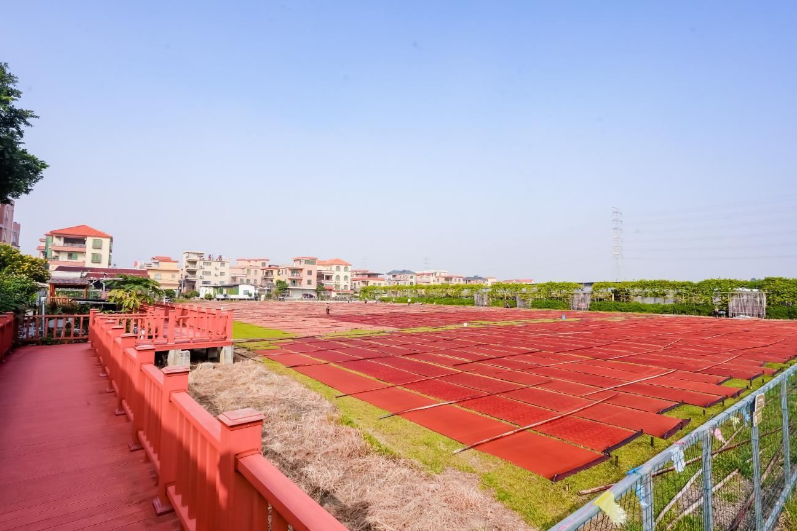

# 广州市云纱星韵非遗文化园景区

## 景点图片

## 基本信息

| 项目 | 内容 |
|------|------|
| 景点名称 | 广州市云纱星韵非遗文化园景区 |
| 所在城市 | 广州市 |
| 所在区县 | 南沙区 |
| 景点级别 | 3A级景区 |
| 景点类型 | 非遗文化园 |
| 开放时间 | 09:00-18:00，临时调整以景区公告为准 |
| 门票价格 | 免费参观，非遗体验等项目以景区公告为准 |
| 联系电话 | 020-84999893 |

## 景点介绍

广州市云纱星韵非遗文化园景区位于南沙区榄核镇湴湄村冼星海故里，以国家级非物质文化遗产香云纱染整技艺为核心。园区于2023年4月被认定为国家3A级旅游景区，主体占地约21亩，并配有约150亩香云纱晒场。

园内设置香云纱文化馆、非遗体验馆、科普馆、研发中心、销售中心、多功能会议及T台空间和室外舞台，集中呈现薯莨染色、河泥涂层、日晒等传统工序及香云纱的生产、研发和活化利用。

## 景点特点

- **国家级非遗主题**：系统展示香云纱染整技艺
- **生产性保护**：文化展示与晒场、研发和销售功能结合
- **非遗体验**：可近距离了解传统染整流程
- **水乡文化环境**：位于榄核镇湴湄村冼星海故里

## 位置

- **地址**：广州市南沙区榄核镇星海路40号之二
- **经纬度**：22.8624°N, 113.3232°E

## 交通

- **公交**：地铁3号线番禺广场站转南沙68路至榄核镇政府站，再转南沙30路至万安村站
- **自驾**：南沙港快速榄核出口，经蔡新路、万安村前往园区停车场

## 数据来源

- [南沙区人民政府：南沙区A级景区名录](https://www.gzns.gov.cn/zwgk/zdlyxxgk/lyscjgzfxx/cyzl/content/post_10886089.html)
- [乡村风景道：云纱星韵非遗文化园景区](https://xcfjd.gtpr.cn/scenic/show_272.html)
- 图片来源：乡村风景道平台，景区图片由区政府提供

## 最后更新时间

2026-07-14
