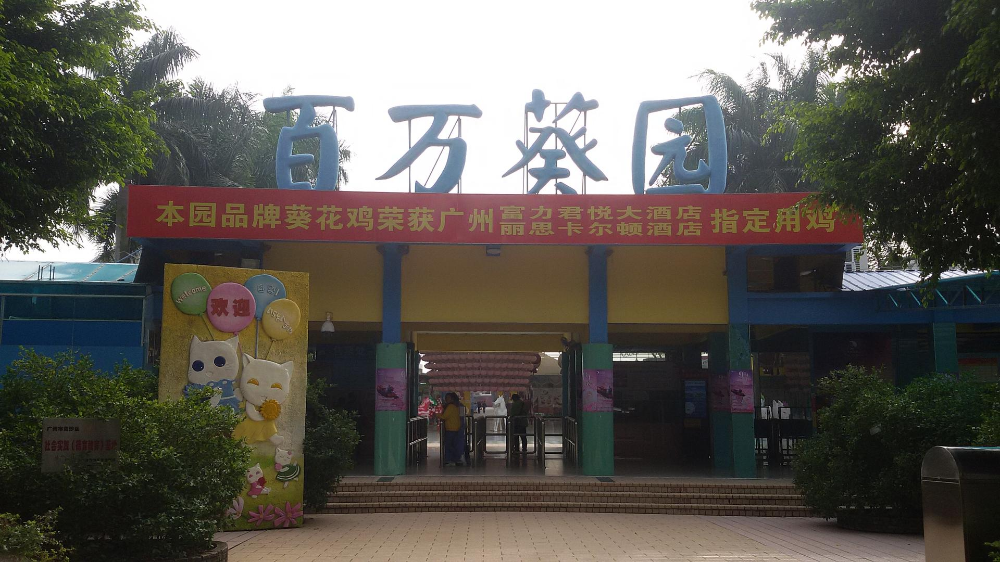

# 百万葵园

## 景点图片

## 基本信息

| 项目 | 内容 |
|------|------|
| 景点名称 | 百万葵园 |
| 所在城市 | 广州市 |
| 所在区县 | 南沙区 |
| 景点级别 | 4A级景区 |
| 景点类型 | 花卉主题公园 |
| 开放时间 | 09:00-17:30 |
| 门票价格 | 85元/人 |

## 景点介绍

百万葵园位于广州市南沙区万顷沙镇，占地约26万平方米，是国内首个以向日葵为主题的大型花卉公园，也是目前全国规模最大的向日葵观赏区。

园内种植有来自世界各地的100多万株向日葵，品种超过20个。除向日葵外，园区还设有玫瑰园、薰衣草园、波斯菊园等多个花卉区域，四季皆有不同的花卉盛放。园内还有松鼠乐园、白鸽广场、锦鲤池等互动区域，以及多项游乐设施。

百万葵园是集花卉观赏、亲子互动、科普教育于一体的综合性旅游景区，尤其适合家庭出游和摄影爱好者。

## 景点特点

- **全国最大向日葵观赏区**：100多万株向日葵，20多个品种
- **四季花海**：不同季节有不同的花卉盛放
- **亲子乐园**：松鼠乐园、白鸽广场等互动区域
- **摄影胜地**：色彩缤纷的花卉景观
- **科普教育**：花卉科普展示和自然教育

## 位置

- **地址**：广州市南沙区万顷沙镇新垦15涌
- **经纬度**：22.6307°N, 113.6196°E

## 交通

- **地铁**：4号线蕉门站，转乘公交至百万葵园
- **公交**：南2路至百万葵园站
- **自驾**：经南沙港快速路至新垦出口

## 数据来源

- [百度百科-百万葵园](https://baike.baidu.com/item/百万葵园)

## 最后更新时间

2026-06-28
