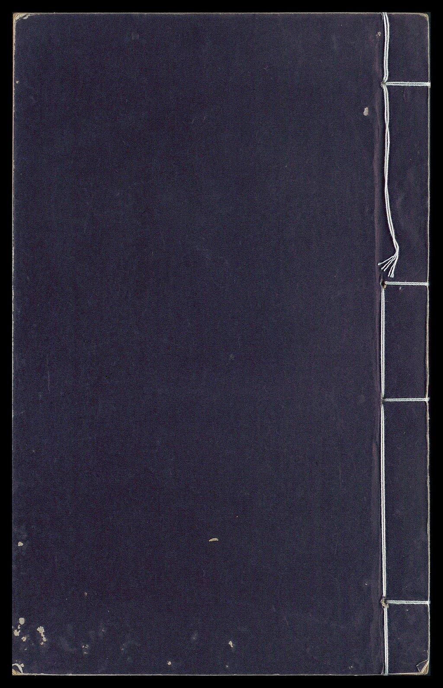

# 蒲洲花园

## 景点图片

## 基本信息

| 项目 | 内容 |
|------|------|
| 景点名称 | 蒲洲花园 |
| 所在城市 | 广州市 |
| 所在区县 | 南沙区 |
| 景点级别 | - |
| 景点类型 | 城市公园 |
| 开放时间 | 全天开放 |
| 门票价格 | 免费 |

## 景点介绍

蒲洲花园位于广州市南沙区南沙湾，毗邻南沙天后宫和南沙滨海公园，是一座以滨海景观为特色的城市花园。花园占地约12万平方米，依山面海，环境优美，是南沙湾畔一处重要的休闲观光场所。

花园以岭南园林风格为基调，融合现代园林设计手法，园内种植有大量热带和亚热带植物，四季绿意盎然。花园内设有观景平台、休闲步道、花架长廊等设施，游客可在此欣赏南沙湾的海景和远眺虎门大桥的壮丽景观。

蒲洲花园与周边的南沙天后宫、南沙滨海公园、南沙客运港等景点共同构成了南沙湾旅游观光带，是游客游览南沙的必经之地。花园也是南沙市民日常休闲健身的热门去处。

## 景点特点

- **滨海花园**：依山面海，可远眺珠江口海景和虎门大桥
- **岭南园林风格**：融合传统岭南园林和现代景观设计
- **毗邻天后宫**：与南沙天后宫仅一墙之隔，可一并游览
- **热带植物丰富**：种植有大量热带和亚热带观赏植物
- **免费开放**：全天候免费对公众开放
- **观景平台**：设有观景台可俯瞰南沙湾美景

## 位置

- **地址**：广州市南沙区南沙湾（近南沙天后宫）
- **经纬度**：22.7618°N, 113.6165°E

## 交通

- **地铁**：4号线南沙客运港站，出站步行约15分钟
- **公交**：南沙3路、南沙5路、南沙18路等至南沙天后宫站
- **自驾**：可导航至南沙天后宫停车场

## 数据来源

- [百度百科-蒲洲花园](https://baike.baidu.com/item/蒲洲花园)

## 最后更新时间

2026-06-28
