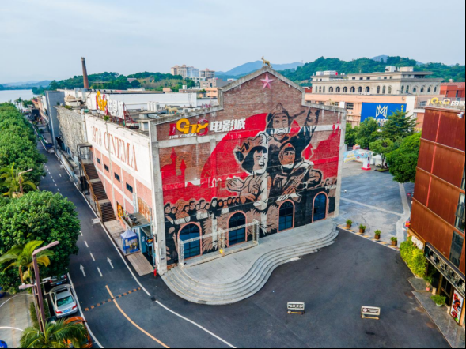

# 1978电影小镇

## 景点图片

## 基本信息

| 项目 | 内容 |
|------|------|
| 景点名称 | 1978电影小镇 |
| 所在城市 | 广州市 |
| 所在区县 | 增城区 |
| 景点级别 | 3A级景区 |
| 景点类型 | 工业遗产、文化创意旅游区 |
| 开放时间 | 园区公共区域全天开放，场馆、活动和商户以各自公告为准 |
| 门票价格 | 园区公共区域免费，体验和消费项目另行收费 |

## 景点介绍

1978电影小镇位于增城区增江街，前身为增城老糖纸厂。项目以糖纸厂遗址为基础，对厂区、旧厂房、旧仓库、周边民居和旧村落进行整合与微改造，形成集文化、娱乐、餐饮、住宿和休闲体验于一体的文创旅游产业聚集区。

园区保留工业建筑和生产记忆，并引入电影、音乐、广告、设计、展演等文化创意业态。2023年6月，1978电影小镇被评为广东省级旅游休闲街区，是当批广州唯一入选的街区。

## 景点特点

- **老糖纸厂活化**：利用厂房、仓库和工业遗存营造文化空间
- **综合文创业态**：涵盖影视、音乐、设计、餐饮和住宿
- **省级旅游休闲街区**：2023年6月获评
- **增江滨水环境**：工业空间与增江沿岸景观相结合

## 位置

- **地址**：广州市增城区增江街沿江东三路15号
- **经纬度**：23.2985°N, 113.8457°E

## 交通

- **地铁公交**：21号线增城广场站转增城17路至1978文化创意园站
- **自驾**：导航至1978电影小镇，停车安排以园区现场指引为准

## 数据来源

- [增城区人民政府：1978电影小镇](https://www.zc.gov.cn/gl/cylx/yzzc/content/post_9191945.html)
- [广州市文化广电旅游局：2025年度国家3A级旅游景区质量等级复核结果](https://wglj.gz.gov.cn/xxgk/gzdt/tzgsgg/content/post_10480870.html)
- 图片来源：广州市增城区人民政府

## 最后更新时间

2026-07-14
