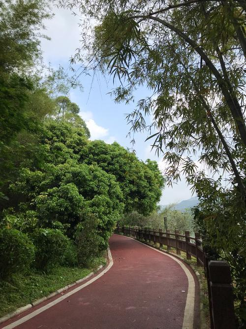

# 增城绿道

## 景点图片

## 基本信息

| 项目 | 内容 |
|------|------|
| 景点名称 | 增城绿道 |
| 所在城市 | 广州市 |
| 所在区县 | 增城区 |
| 景点级别 | - |
| 景点类型 | 绿道景观 |
| 开放时间 | 全天开放 |
| 门票价格 | 免费 |

## 景点介绍

增城绿道位于广州市增城区，是广东省绿道网的重要组成部分，也是全国最早建设的绿道之一。增城绿道总长约500公里，串联起增城的自然景观、乡村田园、历史文化景点和特色美食。

增城绿道分为自行车绿道和步行绿道两种类型，沿途设有驿站、休息亭、观景平台等设施。其中最经典的是"增江画廊"段，沿增江河畔蜿蜒，两岸荔枝林、竹林、稻田交织，景色如画。

增城绿道曾被《中国国家地理》杂志评为"广东最美绿道"，也是广州马拉松、增城马拉松等大型体育赛事的重要赛道。游客可租借自行车沿绿道骑行，体验岭南田园风光。

## 景点特点

- **全国最早绿道之一**：总长约500公里
- **广东最美绿道**：被《中国国家地理》评选
- **增江画廊**：沿增江河畔的田园风光
- **免费开放**：全天可游
- **骑行体验**：沿途设有驿站和设施
- **田园风光**：荔枝林、竹林、稻田交织

## 位置

- **地址**：广州市增城区增江画廊绿道
- **经纬度**：23.2558°N, 113.826°E

## 交通

- **地铁**：21号线增城广场站
- **公交**：增城汽车站转乘各方向公交
- **自驾**：经广河高速至增城出口

## 数据来源

- [百度百科-增城绿道](https://baike.baidu.com/item/增城绿道)

## 最后更新时间

2026-06-25
