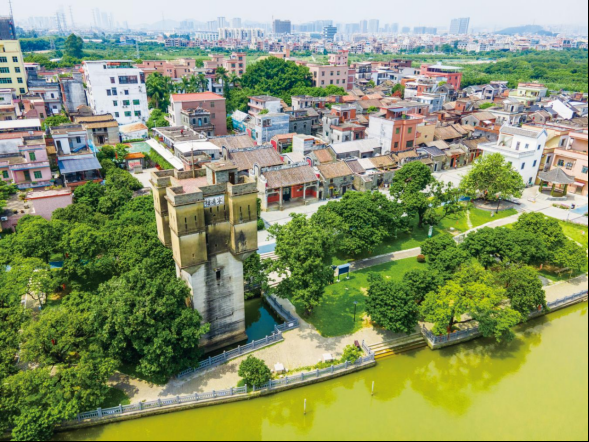

# 广州市增城区瓜岭村——岭南古韵水乡文化旅游景区

## 景点图片

## 基本信息

| 项目 | 内容 |
|------|------|
| 景点名称 | 广州市增城区瓜岭村——岭南古韵水乡文化旅游景区 |
| 所在城市 | 广州市 |
| 所在区县 | 增城区 |
| 景点级别 | 3A级景区 |
| 景点类型 | 古村落、水乡文化旅游景区 |
| 开放时间 | 村庄公共区域全天开放，文物建筑内部及体验场所以现场公告为准 |
| 门票价格 | 村庄公共区域免费，体验项目另行收费 |

## 景点介绍

广州市增城区瓜岭村——岭南古韵水乡文化旅游景区位于新塘镇东北部。瓜岭村已有500多年历史，保存明清时期岭南水乡格局，是广州现存具有代表性的水上清代建筑民居群，也是广东著名侨乡。

村内主要景观包括明清祠堂群、黄国民故居、宁远楼、棠荫楼、古德农创园、瓜洲小学与南华书院、玉虚宫和白石河。其中宁远楼是目前广东省发现的具有代表性的水上碉楼。村落于2020年获评广州市文化和旅游特色村，2021年获评广东省文化和旅游特色村。

## 景点特点

- **五百年古村**：保存明清岭南水乡历史风貌
- **宁远楼**：建于水上的碉楼是村落标志性建筑
- **侨乡文化**：传统民居、祠堂和碉楼反映侨乡历史
- **水乡格局**：白石河、水塘和古建筑共同构成村落景观

## 位置

- **地址**：广州市增城区新塘镇瓜岭村新兴南路1号
- **经纬度**：23.1455°N, 113.6644°E

## 交通

- **地铁公交**：13号线新沙站转乘增城20路或增城22路至瓜岭村一带
- **自驾**：导航至瓜岭村游客服务点，停车请服从村内指引

## 数据来源

- [增城区人民政府：瓜岭村——岭南古韵水乡文化旅游景区](https://www.zc.gov.cn/gl/cylx/yzzc/content/post_9191962.html)
- [广州市农业农村局：增城区瓜岭村古韵新生](https://nyncj.gz.gov.cn/zw/rdzt/2025mlxcyxal/content/post_10523585.html)
- 图片来源：广州市增城区人民政府

## 最后更新时间

2026-07-14
